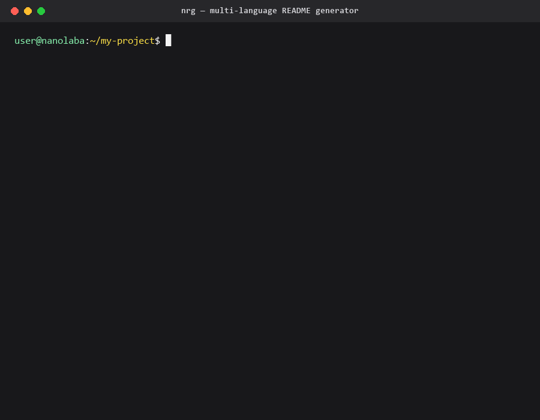

<!-- This file was automatically generated by Nanolaba Readme Generator (NRG) 1.3-SNAPSHOT -->
<!-- Visit https://github.com/nanolaba/readme-generator for details -->


[ [en](README.md) | **ru** ]

# Nanolaba Readme Generator (NRG)

[](https://github.com/nanolaba/readme-generator/actions/workflows/ci.yml)
[](https://central.sonatype.com/artifact/com.nanolaba/readme-generator)
[](https://www.apache.org/licenses/LICENSE-2.0)




**Хватит вручную править один и тот же README на 5 языках.** NRG генерирует `README.md`, `README.ru.md`, `README.zh.md` и любые другие локализованные варианты из одного `.src.md`-исходника. Встроенная CI-проверка drift'а гарантирует, что они больше никогда не разойдутся молча.

**NRG** — это **генератор README** и **шаблонизатор Markdown**, который собирает **многоязычные** README-файлы из одного `.src.md`-исходника. Open-source Java 8+, поставляется как [CLI](#запуск-из-командной-строки), [Maven-плагин](#использование-как-плагина-для-maven), [GitHub Action](#использование-в-качестве-github-action) и [Java-библиотека](#использование-в-качестве-java-библиотеки).

## Краткое описание

С помощью **Nanolaba Readme Generator (NRG)** вы можете: 

- Генерировать README-файлы на нескольких языках 
- Автоматизировать создание документации с помощью динамических шаблонов 
- Создавать удобную в поддержке Markdown-документацию с переменными и виджетами 
- Упрощать создание документации GitHub-проектов 

> 💡 **Пример**: Этот документ был сгенерирован из [этого шаблона](README.src.md). 
> Попробуйте наше **[Руководство по быстрому старту](#quick-start)**, чтобы начать! 


## Ключевые возможности 

- **README на нескольких языках** - Поддержка EN/ZN/RU и любых других языков
- **Drift-проверка в CI** - флаг `--check` (CLI) и `mode: check` (GitHub Action) валят сборку с unified diff, если сгенерированные `.md` разошлись с шаблоном — никакая ручная правка контрибьютора не залетит молча в `main`
- **Переменные** - Повторно используемые блоки контента
- **Готовые виджеты** - Оглавление, импорт файлов, TODO-списки, alert-блоки, бейджи и другие
- **LaTeX-формулы** - Надёжный рендеринг через `$…$` / `$$…$$` или SVG-фолбэк для случаев, где встроенный GitHub MathJax не справляется
- **Гибкая интеграция** - CLI, Maven-плагин или Java-библиотека 
- **Расширяемость** - Возможность писать собственные виджеты для генерации контента 

> 💡 **Nanolaba Readme Generator (NRG)** написан на Java и требует для запуска версии **Java 8** и выше.

Последняя стабильная версия — **1.2**.
Текущая версия разработки — **1.3-SNAPSHOT**.

### Используется в

Этот README сгенерирован самим NRG — см. [`README.src.md`](README.src.md). Тот же шаблон поддерживает в синхроне `README.ru.md`.


## Содержание
- 1 [Быстрый старт](#быстрый-старт)
- 2 [Способы запуска программы](#способы-запуска-программы)
	- 2.1 [Запуск из командной строки](#запуск-из-командной-строки)
		- 2.1.1 [Проверка сгенерированных файлов (режим CI)](#проверка-сгенерированных-файлов-режим-ci)
		- 2.1.2 [Валидация исходных шаблонов](#валидация-исходных-шаблонов)
		- 2.1.3 [Вывод в stdout](#вывод-в-stdout)
		- 2.1.4 [Уровень логирования](#уровень-логирования)
		- 2.1.5 [Настройка имён выходных файлов](#настройка-имён-выходных-файлов)
		- 2.1.6 [Перевод строк](#перевод-строк)
		- 2.1.7 [Настройка заголовка](#настройка-заголовка)
		- 2.1.8 [Несколько файлов и glob-паттерны](#несколько-файлов-и-glob-паттерны)
	- 2.2 [Использование как плагина для maven](#использование-как-плагина-для-maven)
	- 2.3 [Использование в качестве GitHub Action](#использование-в-качестве-github-action)
		- 2.3.1 [Быстрый старт](#быстрый-старт)
		- 2.3.2 [Входные параметры](#входные-параметры)
		- 2.3.3 [Выходные значения](#выходные-значения)
		- 2.3.4 [Примеры](#примеры)
			- 2.3.4.1 [Базовая генерация](#базовая-генерация)
			- 2.3.4.2 [Проверка расхождений в PR](#проверка-расхождений-в-pr)
			- 2.3.4.3 [Drift-проверка по подмножеству файлов](#drift-проверка-по-подмножеству-файлов)
		- 2.3.5 [Проекты с несколькими шаблонами](#проекты-с-несколькими-шаблонами)
		- 2.3.6 [Отключение встроенного setup-java](#отключение-встроенного-setup-java)
		- 2.3.7 [Закрепление версии action](#закрепление-версии-action)
		- 2.3.8 [Решение проблем](#решение-проблем)
	- 2.4 [Использование в качестве java-библиотеки](#использование-в-качестве-java-библиотеки)
- 3 [Синтаксис шаблона](#синтаксис-шаблона)
	- 3.1 [Переменные](#переменные)
	- 3.2 [Обратные слэши и экранирование](#обратные-слэши-и-экранирование)
	- 3.3 [Свойства](#свойства)
	- 3.4 [Переопределения для разных языков](#переопределения-для-разных-языков)
	- 3.5 [Переменные окружения](#переменные-окружения)
	- 3.6 [Значения из Maven POM](#значения-из-maven-pom)
	- 3.7 [Значения из package.json](#значения-из-packagejson)
	- 3.8 [Значения из Gradle](#значения-из-gradle)
	- 3.9 [Multilanguage support](#multilanguage-support)
	- 3.10 [Игнорирование фрагментов](#игнорирование-фрагментов)
	- 3.11 [Замороженные области](#замороженные-области)
	- 3.12 [Виджеты](#виджеты)
		- 3.12.1 [Виджет 'languages'](#виджет-languages)
		- 3.12.2 [Виджет 'import'](#виджет-import)
		- 3.12.3 [Виджет 'tableOfContents'](#виджет-tableofcontents)
		- 3.12.4 [Виджет 'date'](#виджет-date)
		- 3.12.5 [Виджет 'todo'](#виджет-todo)
		- 3.12.6 [Виджет 'alert'](#виджет-alert)
		- 3.12.7 [Виджет 'badge'](#виджет-badge)
		- 3.12.8 [Виджет 'math'](#виджет-math)
		- 3.12.9 [Виджет 'exec'](#виджет-exec)
		- 3.12.10 [Виджет 'if'](#виджет-if)
		- 3.12.11 [Виджет 'fileTree'](#виджет-filetree)
		- 3.12.12 [Виджет 'details'](#виджет-details)
- 4 [Расширенные возможности](#расширенные-возможности)
	- 4.1 [Создание виджета](#создание-виджета)
- 5 [Похожие проекты](#похожие-проекты)
- 6 [История изменений](#история-изменений)
- 7 [Обратная связь и поддержка](#обратная-связь-и-поддержка)
	- 7.1 [Поддержка сообщества](#поддержка-сообщества)
	- 7.2 [Прямая связь](#прямая-связь)
	- 7.3 [Рекомендации](#рекомендации)


## Быстрый старт

**Что нужно:** Java 8 или выше ([скачать](https://www.java.com/en/download/)).

**Шаг 1: Создайте минимальный шаблон (`README.src.md`)**

```markdown
<!--@nrg.languages=en,ru-->

# Hello<!--en-->
# Привет<!--ru-->

English text<!--en-->
Русский текст<!--ru-->
```

Строки, помеченные `<!--en-->`, попадут в `README.md`; строки с `<!--ru-->` — в `README.ru.md`.

**Шаг 2: Сгенерируйте файлы**

**Вариант A — CLI.** [Скачайте](https://github.com/nanolaba/readme-generator/releases/tag/v1.2) автономный jar, распакуйте архив и запустите:

```bash
nrg -f /path/to/README.src.md
```

**Вариант B — Maven-плагин.** Добавьте в `pom.xml` (полная конфигурация ниже, в разделе [«Использование как плагина для maven»](#использование-как-плагина-для-maven)):

```xml
<plugin>
    <groupId>com.nanolaba</groupId>
    <artifactId>nrg-maven-plugin</artifactId>
    <version>1.2</version>
    <configuration>
        <file><item>README.src.md</item></file>
    </configuration>
    <executions>
        <execution>
            <phase>compile</phase>
            <goals><goal>create-files</goal></goals>
        </execution>
    </executions>
</plugin>
```

**Шаг 3: Проверьте результат**

Рядом с шаблоном появятся два файла — `README.md` и `README.ru.md`:

<table>
<tr><th><b>README.md</b></th><th><b>README.ru.md</b></th></tr>
<tr><td>

```markdown
# Hello

English text
```

</td><td>

```markdown
# Привет

Русский текст
```

</td></tr></table>

**Что дальше**

- Переменные, многоязычный синтаксис и экранирование — см. [«Синтаксис шаблона»](#синтаксис-шаблона).
- Готовые виджеты (оглавление, импорт, языки, дата, todo, alert, badge, math, exec, if, fileTree, details) — см. [«Виджеты»](#виджеты).

<details>
<summary><b>Полный пример шаблона (все виджеты)</b></summary>

```markdown
<!--@nrg.languages=en,ru-->
<!--@nrg.defaultLanguage=en-->

<!--@title=**${en:'Hello, World!', ru:'Привет, Мир!'}**-->
<!--@version=1.0-->

${widget:languages}

${widget:badge(type='maven-central', coordinates='com.example:my-project')}

# ${title}<!--toc.ignore-->

Last updated: ${widget:date}

${widget:tableOfContents(title = "${en:'Table of contents', ru:'Содержание'}", ordered = "true")}

## Part 1<!--toc.ignore-->

### Chapter 1<!--toc.ignore-->

English text<!--en-->
Русский текст<!--ru-->

${widget:alert(type='note', text='${en:'Heads up!', ru:'Обратите внимание!'}')}

The area of a circle is ${widget:math(expr='\\pi r^2')}.

${widget:todo(text="${en:'Document the next chapter', ru:'Описать следующую главу'}")}

${widget:if(cond='endsWith(${version}, -SNAPSHOT)')}
This is a development build.
${widget:endIf}

${widget:exec(cmd='git rev-parse --short HEAD', codeblock='text')}

${widget:fileTree(path='src/main/java', depth='2', exclude='target,*.class')}

${widget:import(path='path/to/your/file/another-info.src.md')}

${widget:details(summary='Advanced configuration')}
Hidden inner markdown — ${widget:date(pattern='yyyy')} still works in here.
${widget:endDetails}

${widget:details(summary='Click', content='Short hidden text', open='true')}
```

</details>

## Способы запуска программы

### Запуск из командной строки

**Nanolaba Readme Generator (NRG)** написан на Java и требует для запуска версии **Java 8** и выше.
[Установите](https://www.java.com/en/download/) Java, если она отсутствует у вас в системе.

[Скачайте](https://github.com/nanolaba/readme-generator/releases/tag/v1.2) последнюю 
стабильную версию приложения.

Разархивируйте скачанный архив. Если вы используете Unix-like системы, то назначьте файлу `nrg.sh` права 
на исполнение:

```bash
chmod +x nrg.sh  
```

Теперь вы можете запустить программу для генерации файлов:

```bash
nrg -f /path/to/README.src.md
```

Чтобы посмотреть список доступных опций консольного приложения наберите:

```bash
nrg --help
```

#### Проверка сгенерированных файлов (режим CI)

Флаг `--check` проверяет, что файлы на диске совпадают с тем, что
NRG сгенерировал бы прямо сейчас. Режим предназначен для CI / pre-commit:
файлы не записываются, при отсутствии или расхождении выводится diff
в stderr, процесс завершается с кодом `1`.

```bash
nrg --check -f README.src.md && echo "README is up to date"
```

`--check` проверяет все языки, заявленные в `nrg.languages`, и
несовместим с флагом `--stdout`.

`--check-paths <шаблон>` (повторяемый) ограничивает проверку выходными
файлами, путь которых совпадает с одним из указанных glob-шаблонов.
Шаблоны используют тот же синтаксис `glob:`, что и мульти-файловые
исходные glob-ы (`**/` соответствует нулю и более каталогов), и
разрешаются относительно текущего каталога. Выходы, не попавшие ни
под один шаблон, пропускаются и в diff, и в проверке наличия — удобно,
когда часть сгенерированных файлов лежит в git, а остальные регенерирует
бот. Шаблон без совпадений печатает `WARN` в stderr (код выхода всё равно
`0`), чтобы опечатка не отключала проверку молча. `--check-paths`
требует `--check`.

```bash
nrg --check --check-paths README.md -f README.src.md
```

#### Валидация исходных шаблонов

Флаг `--validate` сканирует шаблон (и все импортируемые через
`${widget:import}` файлы) на типичные ошибки авторов, ничего не
генерируя. В v1 проверяются четыре класса ошибок:

- незарегистрированные имена виджетов (`${widget:doesNotExist}`),
- языковые маркеры `<!--xx-->`, чей код отсутствует в `nrg.languages`,
- пути в `${widget:import(path='...')}`, которых нет на диске,
- несбалансированные пары `<!--nrg.ignore.begin-->` / `<!--nrg.ignore.end-->`.

```bash
nrg --validate -f README.src.md && echo "Template is clean"
```

Каждое сообщение печатается в формате `ERROR: file.src.md:LINE: text`.
Без ошибок NRG молча завершается с кодом `0`. При наличии хотя бы одной
ошибки все сообщения печатаются в stderr, процесс завершается с кодом
`1`. `--validate` несовместим с `--check` и `--stdout`.

#### Вывод в stdout

Флаг `--stdout` перенаправляет сгенерированный вывод в stdout,
файлы на диск при этом не создаются. В сочетании с `--language <код>`
печатается только один языковой вариант; без него выводятся все
настроенные варианты, каждый предваряется строкой-разделителем вида
`=== README.ru.md ===`, чтобы вывод можно было разрезать во внешних инструментах.

```bash
nrg --stdout -f README.src.md
nrg --stdout --language en -f README.src.md
```

Флаг `--language` имеет смысл только вместе с `--stdout` — в одиночку
он логируется как предупреждение и игнорируется.

#### Уровень логирования

Управляйте детализацией вывода через `--log-level`. Допустимые значения —
`trace`, `debug`, `info` (по умолчанию), `warn`, `error`; каждый уровень
подавляет сообщения ниже по важности. Если флаг не задан, используется
переменная окружения `NRG_LOG_LEVEL` — удобно для CI и Maven-плагина.
Неизвестное значение приводит к завершению с сообщением об ошибке в stderr.

```bash
nrg --log-level warn -f /path/to/README.src.md
NRG_LOG_LEVEL=warn nrg -f /path/to/README.src.md
```

#### Настройка имён выходных файлов

Флаг `--file-name-pattern <PATTERN>` переопределяет схему имени выходного
файла. Плейсхолдеры: `<base>` (имя исходного файла без `.src.md`), `<lang>`
(код языка как есть), `<LANG>` (в верхнем регистре). Паттерн может содержать
`/` — недостающие каталоги создаются автоматически. Эквивалент свойства
`<!--@nrg.fileNamePattern=PATTERN-->`; CLI-флаг побеждает шаблон.
Флаг `--default-language-file-name-pattern <PATTERN>` переопределяет только
язык по умолчанию (зеркало `<!--@nrg.defaultLanguageFileNamePattern=PATTERN-->`).
Пер-языковые переопределения (`<!--@nrg.fileNamePattern.<lang>=...-->`)
доступны только в шаблоне и CLI-аналога не имеют.

```bash
nrg --file-name-pattern '<base>_<LANG>.md' -f README.src.md
nrg --file-name-pattern 'docs/<lang>/<base>.md' --default-language-file-name-pattern '<base>.md' -f README.src.md
```

#### Перевод строк

`--line-ending=auto|lf|crlf` управляет переводом строк в сгенерированном
выводе. По умолчанию `auto` сохраняет конвенцию уже лежащего на диске
файла (CRLF останется CRLF, LF — LF) и откатывается на системный default
при первой генерации. Значения `lf` и `crlf` жёстко фиксируют формат —
полезно, например, для Windows-контрибьюторов, регенерирующих
Linux-репозитории с LF, и наоборот.

```bash
nrg --line-ending lf -f README.src.md
nrg --line-ending crlf -f README.src.md
```

В режиме `--check` со значением `auto` различия только в переводах строк
против файла на диске не считаются ошибкой (повторная генерация и так
сохранила бы существующую конвенцию), поэтому контрибьюторы с разных
ОС не валят CI. Явные `lf` / `crlf` всё равно сигнализируют о несовпадении
— это инвариант, который пользователь явно запросил.

#### Настройка заголовка

По умолчанию каждый сгенерированный файл начинается с двух строк HTML-
комментария, предупреждающих контрибьюторов не редактировать его руками.
Два флага переопределяют это поведение: `--no-header` полностью убирает
комментарий, `--header-text "..."` заменяет его произвольным текстом
(используйте `\n` для переноса строки, также `\r`, `\t`, `\\`).
Флаги взаимно исключающие. Эквивалентные свойства шаблона
`<!--@nrg.noHeader=true-->` и `<!--@nrg.headerText=...-->` работают
аналогично; CLI-флаг побеждает значение в шаблоне.

```bash
nrg --no-header -f README.src.md
nrg --header-text '<!-- See /wiki for editing rules -->\n<!-- Auto-generated; do not edit -->' -f README.src.md
```

#### Несколько файлов и glob-паттерны

В одну команду можно передать несколько исходных файлов — либо явным
списком, либо glob-паттернами:

```bash
nrg README.src.md docs/Guide.src.md
nrg "docs/**/*.src.md"
```

Раскрытие glob-паттерна выполняется через `java.nio.file.PathMatcher`
с синтаксисом `glob:` — поведение одинаково на Windows, Linux и macOS
независимо от командной оболочки. Заключайте паттерн в кавычки, чтобы
сначала его не раскрыл сам шелл. Старый флаг `-f <file>` остаётся как
алиас для единственного файла и несовместим с позиционными аргументами —
их совместная передача приводит к ошибке и коду возврата `1`.

По умолчанию каждый файл обрабатывается независимо: ошибка на одном
логируется, но остальные продолжают выполняться, а общий код возврата
равен `1`, если упал хотя бы один. Флаг `--fail-fast` останавливает
обработку на первом ненулевом результате.

```bash
nrg --fail-fast "docs/**/*.src.md"
```

Паттерн без совпадений логируется как предупреждение. Если ни один из
входов не нашёл файлов, программа завершается с кодом `1` и сообщением
`No source files matched any of the supplied patterns`.

### Использование как плагина для maven

Добавьте следующий код в ваш `pom.xml`:

```xml

<plugins>
    <plugin>
        <groupId>com.nanolaba</groupId>
        <artifactId>nrg-maven-plugin</artifactId>
        <version>1.2</version>
        <configuration>
            <file>
                <item>README.src.md</item>
                <item>another-file.src.md</item>
            </file>
            <logLevel>warn</logLevel>
            <widgets>
                <widget>com.example.MyWidget</widget>
                <widget>com.example.OtherWidget</widget>
            </widgets>
            <check>false</check>
            <failFast>false</failFast>
            <lineEnding>auto</lineEnding>
            <noHeader>false</noHeader>
        </configuration>
        <dependencies>
            <dependency>
                <groupId>com.example</groupId>
                <artifactId>my-widgets</artifactId>
                <version>1.0.0</version>
            </dependency>
        </dependencies>
        <executions>
            <execution>
                <phase>compile</phase>
                <goals>
                    <goal>create-files</goal>
                </goals>
            </execution>
        </executions>
    </plugin>
</plugins>
```

Каждый элемент `<file>` может быть как явным путём, так и glob-паттерном
(тот же синтаксис `glob:`, что и в CLI). Многодокументные проекты могут
заменить длинный список одним `<file>**/*.src.md</file>`, NRG раскроет
паттерн сам. Параметр `<failFast>true</failFast>` (или `-DfailFast=true`)
прерывает обработку на первом ненулевом результате; по умолчанию `false` —
сохраняется сегодняшнее поведение с агрегированием диагностик по всем
найденным файлам.

`<noHeader>true</noHeader>` (или `-DnoHeader=true`) убирает автоматический
двухстрочный head-комментарий из каждого выходного файла;
`<headerText>...</headerText>` (или `-DheaderText="..."`) заменяет его
произвольным текстом. Используйте `\n` для перевода строк. Параметры
взаимно исключающие — одновременная передача роняет сборку с ошибкой
разбора аргументов CLI.


> [!NOTE]
> **Многомодульные (aggregator) проекты:** цель `create-files` объявлена с
> `inheritByDefault = false`, поэтому дочерние модули агрегатора с
> `<packaging>pom</packaging>` **не** перезапускают NRG в собственном каталоге
> по умолчанию (где `README.src.md` обычно отсутствует). Объявите плагин один
> раз в родительском POM, и цель отработает только в корне. Если дочернему
> модулю всё же нужна собственная генерация README, явно включите её через
> `<inherited>true</inherited>` в его POM.

Элементы `<widgets>` должны указывать на публичные классы, реализующие
`NRGWidget` и имеющие публичный конструктор без аргументов; их артефакт
необходимо подключить через `<dependencies>` самого плагина, чтобы
Maven мог их найти. При совпадении имён виджеты из POM имеют приоритет
над объявленными через свойство шаблона `nrg.widgets`.

Параметр `<check>true</check>` (или `-Dcheck=true` из командной строки)
переключает плагин в режим проверки: файлы не записываются, при
расхождении сборка падает с `MojoExecutionException` и выводом diff
в лог. Удобно для шага `mvn verify` в CI, чтобы не пропустить устаревший
README.

Параметр `<validate>true</validate>` (или `-Dvalidate=true`) сканирует
шаблоны на типичные ошибки авторов (неизвестные виджеты, отсутствующие
импорты, незаявленные языковые маркеры, несбалансированные ignore-блоки)
без генерации файлов. Сборка падает с `MojoExecutionException` при
наличии диагностик. Несовместим с `<check>`.

Параметры `<fileNamePattern>` и `<defaultLanguageFileNamePattern>` (либо
`-DfileNamePattern=...` / `-DdefaultLanguageFileNamePattern=...`) дублируют
CLI-флаги `--file-name-pattern` / `--default-language-file-name-pattern` и
переопределяют свойства шаблона `nrg.fileNamePattern` /
`nrg.defaultLanguageFileNamePattern`, если заданы.

Для использования SNAPSHOT-версий также необходимо добавить в `pom.xml` следующий код:

```xml

<pluginRepositories>
    <pluginRepository>
        <id>central.sonatype.com-snapshot</id>
        <url>https://central.sonatype.com/repository/maven-snapshots</url>
        <releases>
            <enabled>false</enabled>
        </releases>
        <snapshots>
            <enabled>true</enabled>
            <updatePolicy>always</updatePolicy>
        </snapshots>
    </pluginRepository>
</pluginRepositories>
```

### Использование в качестве GitHub Action

NRG доступен как composite GitHub Action: любой репозиторий может
регенерировать мультиязычные README прямо в CI, не устанавливая Maven или
Java локально. Action (опционально) ставит Java, скачивает нужный релиз
NRG, извлекает `nrg.jar` и запускает его для перечисленных шаблонов —
поддержка README сводится к одному шагу workflow.

#### Быстрый старт

```yaml
- uses: actions/checkout@v4
- uses: nanolaba/nrg-action@v1
  with:
    file: README.src.md
```

#### Входные параметры

| Имя | Описание | По умолчанию |
|---|---|---|
| `file` | Путь к `.src.md`-шаблону (относительно `working-directory`). Для нескольких файлов используйте `files`. | — |
| `files` | Многострочный список шаблонов (по одному на строку). Не совместим с `file`. | — |
| `charset` | Кодировка исходных файлов. | `UTF-8` |
| `mode` | Режим работы: `generate`, `check` или `validate`. | `generate` |
| `check-paths` | Многострочный список glob-шаблонов (по одному на строку), ограничивающий, какие сгенерированные файлы `mode: check` сравнивает с файлами на диске. Требует `mode: check`. | — |
| `nrg-version` | Тег релиза NRG (например, `v1.0`) или `latest`. | `latest` |
| `java-version` | Версия JDK для `actions/setup-java`. Игнорируется при `setup-java=false`. | `17` |
| `java-distribution` | Дистрибутив JDK для `actions/setup-java`. | `temurin` |
| `setup-java` | Должен ли action сам устанавливать Java. Передайте `"false"`, если Java уже установлена в предыдущем шаге job-а. | `true` |
| `log-level` | Уровень логирования NRG: `trace`, `debug`, `info`, `warn` или `error`. | `info` |
| `working-directory` | Рабочий каталог, в котором запускается NRG. | `.` |

Семантика режима (`mode`):

- `generate` записывает `README.md`, `README.ru.md`, … на диск (по умолчанию).
- `check` — проверка без записи: если файлы на диске расходятся с тем, что сгенерировал бы NRG, action завершается с ненулевым кодом и печатает unified diff. Удобен для pull request-ов.
- `validate` проверяет шаблон на авторские ошибки (неизвестные виджеты, необъявленные языковые маркеры, отсутствующие импорты, несбалансированные ignore-блоки). Файлы не записываются.

#### Выходные значения

| Имя | Описание |
|---|---|
| `version` | Итоговая версия NRG (например, `v1.0`). Полезно при `nrg-version=latest`. |
| `changed-files` | Список файлов, созданных или изменённых NRG, по одному на строку. |

#### Примеры

##### Базовая генерация

Регенерация README при каждом push в `main`:

```yaml
name: Regenerate README
on:
  push:
    branches: [main]
permissions:
  contents: read
jobs:
  regenerate:
    runs-on: ubuntu-latest
    steps:
      - uses: actions/checkout@v4
      - uses: nanolaba/nrg-action@v1
        with:
          file: README.src.md
```

##### Проверка расхождений в PR

Завершать сборку с ошибкой, если автор изменил `README.md` напрямую, вместо того чтобы перегенерировать его из `README.src.md`:

```yaml
name: README drift check
on:
  pull_request:
    paths: ['**/*.src.md', '**/*.md']
permissions:
  contents: read
jobs:
  check:
    runs-on: ubuntu-latest
    steps:
      - uses: actions/checkout@v4
      - uses: nanolaba/nrg-action@v1
        with:
          file: README.src.md
          mode: check
```

##### Drift-проверка по подмножеству файлов

Когда в git лежит только часть сгенерированных файлов (например, коммитится только канонический `README.md`, а переводы регенерируются ботом), `check-paths` сужает сравнение до перечисленных. Шаблоны — cwd-относительные `glob:`-маски (`**/` соответствует нулю и более каталогов). Шаблон без совпадений печатает `WARN` в stderr, но завершается с кодом `0`, чтобы опечатка не отключала проверку молча:

```yaml
- uses: nanolaba/nrg-action@v1
  with:
    file: README.src.md
    mode: check
    check-paths: |
      README.md
      docs/canonical/*.md
```

Рецепты «только валидация» и «авто-коммит через PR» лежат в каталоге [`nrg-action/examples`](https://github.com/nanolaba/readme-generator/tree/main/nrg-action/examples) этого репозитория.

#### Проекты с несколькими шаблонами

Передайте многострочный список в параметр `files:` (по одному пути на строку). Все файлы обрабатываются за один вызов action-а, jar скачивается ровно один раз. `file` и `files` не совместимы — задавайте только один из них.

```yaml
- uses: nanolaba/nrg-action@v1
  with:
    files: |
      README.src.md
      docs/CONTRIBUTING.src.md
```

#### Отключение встроенного setup-java

Если в окружающем workflow Java уже устанавливается (например, для Maven-сборки), встроенный шаг `actions/setup-java@v4` можно отключить. Параметры composite action-а — строки, поэтому используйте `"false"` в кавычках, а не YAML-литерал:

```yaml
- uses: actions/setup-java@v4
  with:
    distribution: temurin
    java-version: '21'
- uses: nanolaba/nrg-action@v1
  with:
    file: README.src.md
    setup-java: 'false'
```

#### Закрепление версии action

`@v1` — автообновления в пределах major-версии v1 (рекомендуется); `@v1.0` — жёсткая фиксация minor-версии; `@<full-sha>` — привязка к конкретному коммиту (наиболее безопасный вариант; требуется некоторыми политиками безопасности цепочки поставок).

#### Решение проблем

Большинство сбоев в CI делятся на три группы: проблемы скачивания (проверьте, что `nrg-version` есть на странице [Releases](https://github.com/nanolaba/readme-generator/releases)), изменения структуры zip-архива (заведите issue, если появляется `nrg.jar not found inside …`), и платформенные особенности. Самая частая особенность — расхождение переводов строк на `windows-latest`: `mode: check` показывает diff, которого нет локально.

- **Расхождение переводов строк на Windows-раннерах** — добавьте в `.gitattributes` строку `* text=auto eol=lf` и закоммитьте сгенерированные файлы заново.
- **Windows: `unzip: command not found`** — git-bash на `windows-latest` обычно содержит `unzip`; в редких образах добавьте предыдущим шагом `choco install unzip`.

Action опубликован как отдельный репозиторий [`nanolaba/nrg-action`](https://github.com/nanolaba/nrg-action) (теги `v1.0` и rolling `v1`) — именно по этому адресу пользователи подключают его через `uses:`. Подкаталог `nrg-action/` — это dev-воркспейс, где живут исходники и регрессионные тесты action; релизы зеркалируются в отдельный репозиторий. Публикация в GitHub Marketplace — следующий шаг.


### Использование в качестве java-библиотеки

**Maven (pom.xml)**

```xml

<dependency>
    <groupId>com.nanolaba</groupId>
    <artifactId>readme-generator</artifactId>
    <version>1.2</version>
</dependency>  
```

**Gradle (build.gradle)**

```groovy
implementation 'com.nanolaba:readme-generator:1.2'
```

**Скачивание вручную**

Скачайте JAR из [Maven Central](https://repo1.maven.org/maven2/com/nanolaba/readme-generator/1.2)
и добавьте его в classpath проекта.

После этого вы можете в своем проекте вызывать функцию создания файлов, 
передав те же параметры, что и в консольном приложении, например:

```java
NRG.main("-f","path-to-file","--charset","UTF-8");
```

Альтернативным вариантом, а также более гибким в плане настройки поведения 
программы, является использование класса `Generator`:

```java
package com.nanolaba.nrg.examples;

import com.nanolaba.nrg.core.GenerationResult;
import com.nanolaba.nrg.core.Generator;
import org.apache.commons.io.FileUtils;

import java.io.File;
import java.io.IOException;
import java.nio.charset.StandardCharsets;

public class GeneratorExample {

    public static void main(String[] args) throws IOException {

        Generator generator = new Generator(new File("template.md"), StandardCharsets.UTF_8);

        for (GenerationResult generationResult : generator.getResults()) {

            FileUtils.write(
                    new File("result." + generationResult.getLanguage() + ".md"),
                    generationResult.getContent(),
                    StandardCharsets.UTF_8);
        }
    }
}

```

## Синтаксис шаблона

### Переменные

Синтаксис шаблона поддерживает использование переменных.
Определение переменных происходит при помощи конструкции:

```markdown
<!--@variable_name=variable value-->
```

Вывод значения переменных происходит при помощи конструкции вида:

```markdown
${variable_name}
```

Чтобы вывести в файл конструкцию вида *${...}*, не заменяя ее значением
переменной, предварите ее символом '\\':

```markdown
\${variable_name}
```

<table>
<tr><th>Пример использования</th><th>Результат</th></tr>
<tr><td>

```markdown
<!--@app_name=My Application-->
<!--@app_version=**1.0.1**-->
<!--@app_descr=This is *${app_name}* version ${app_version}-->
${app_name} version ${app_version}
${app_descr}
\${app_descr}
```

</td><td>

```markdown
My Application version **1.0.1**
This is *My Application* version **1.0.1**
${app_descr}
```

</td></tr>
</table>

### Обратные слэши и экранирование

После того как все подстановки и виджеты отработали, корневой генератор делает один финальный
проход и убирает обратный слэш только в этих трёх шаблонах; любая другая последовательность
`\\X` остаётся в выводе как есть.

| В шаблоне | В выводе | Зачем нужно |
|---|---|---|
| <code>&#92;$</code>        | <code>$</code>        | подавить любую ссылку `\${…}` (свойство / язык / env / pom / npm / gradle / widget). Срабатывает на **любое** `\$`, не только на `\${…}`. |
| <code>&lt;&#92;!--</code>  | <code>&lt;!--</code>  | подавить любой HTML-маркер — языковой тег, `nrg.ignore`, `nrg.freeze`, объявление свойства. Используется, чтобы вывести литерал `<!--…-->`. |
| <code>&lt;!--&#92;@</code> | <code>&lt;!--@</code> | красиво вывести `<!--@key=value-->` в примере — **только косметика**, **не** мешает NRG распарсить строку как настоящее объявление свойства. Чтобы реально подавить разбор, экранируйте открытие комментария по правилу 2: <code>&lt;&#92;!--@key=value--&gt;</code>. |

Эскейпы самого Markdown (`\(`, `\)`, `\_`, `\*`, `\\`, `` \` `` и т. п.) в этот список
не входят — они проходят NRG без изменений и попадают на рендерер Markdown как есть.


> [!TIP]
> Правило 1 убирает обратный слэш у **любой** последовательности `\$`, не только у `\${…}`.
> Чтобы оставить в выводе литерал `\$` (например, для `[\$]` в markdown-ссылке без подстановки),
> пишите в шаблоне `\\$` — замыкающий `\$` превратится в `$`, ведущий `\` останется на месте.

### Свойства

При помощи синтаксиса установки значений переменных в шаблоне можно указывать свойства приложения, например:

```markdown
<!--@nrg.languages=en,ru-->
<!--@nrg.defaultLanguage=en-->
```

**Свойства приложения:**

***nrg.languages***

Перечень языков, для которых будут сгенерированы файлы.
Для каждого языка, за исключением языка по-умолчанию, будет сгенерирован файл с
наименованием вида *source.language.md*, где source - наименование исходного файла, language - наименование
языка. Значение этого свойства по умолчанию - "en".

***nrg.defaultLanguage***

Язык, на котором будет сгенерирован главный файл документации.
Название языка должно содержаться в перечне, определенным в свойстве *nrg.languages*.
Значение этого свойства по умолчанию - первый элемент списка из свойства *nrg.languages*.

***nrg.widgets***

Comma-separated полные имена классов реализаций `NRGWidget`, которые нужно
зарегистрировать дополнительно к встроенным виджетам. Каждый класс должен быть
доступен на runtime-classpath и иметь публичный конструктор без аргументов.
Эквивалентно CLI-флагу `--widgets <FQCN,FQCN,...>` и параметру `<widgets>` Maven-плагина.

***nrg.pom.path***

Переопределяет путь к `pom.xml`, используемый подстановкой `${pom.NAME}`.
Относительные пути разрешаются относительно каталога исходного файла; абсолютные
используются как есть. По умолчанию — `pom.xml` рядом с исходным файлом.
Учитывается только когда в шаблоне есть ссылки `${pom.…}`.

***nrg.npm.path***

Переопределяет путь к `package.json`, используемый подстановкой `${npm.NAME}`.
Относительные пути разрешаются относительно каталога исходного файла; абсолютные
используются как есть. По умолчанию — `package.json` рядом с исходным файлом.
Учитывается только когда в шаблоне есть ссылки `${npm.…}`.

***nrg.gradle.path***

Переопределяет расположение Gradle, используемое подстановкой `${gradle.NAME}`.
Может указывать либо на каталог (с `gradle.properties` и/или `build.gradle{,.kts}`),
либо на конкретный build-скрипт. Относительные пути разрешаются относительно
каталога исходного файла; абсолютные используются как есть. По умолчанию —
каталог исходного файла. Учитывается только когда в шаблоне есть ссылки `${gradle.…}`.

***nrg.fileNamePattern***

Шаблон имени выходного файла для всех языков. Плейсхолдеры: `<base>` (имя исходного
файла без `.src.md`), `<lang>` (код языка как есть), `<LANG>` (код языка в верхнем
регистре). Может содержать `/` — недостающие каталоги создаются автоматически.
По умолчанию — `<base>.md` для языка по умолчанию и `<base>.<lang>.md` для остальных.
Примеры: `<base>_<LANG>.md`, `<base>-<lang>.md`, `docs/<lang>/<base>.md`.

***nrg.defaultLanguageFileNamePattern***

Переопределяет `nrg.fileNamePattern` только для языка по умолчанию. Удобно когда
основной язык должен лежать как `README.md`, а остальные — с суффиксом:
`nrg.fileNamePattern=<base>_<LANG>.md` + `nrg.defaultLanguageFileNamePattern=<base>.md`.

***nrg.fileNamePattern.&lt;lang&gt;***

Переопределение для конкретного языка (например `nrg.fileNamePattern.zh-CN=README_<LANG>.md`).
Имеет приоритет и над `nrg.fileNamePattern`, и над `nrg.defaultLanguageFileNamePattern`
для указанного языка. Порядок разрешения: per-language → default-language → global → встроенный.
Если два сконфигурированных языка попадают в один и тот же файл, генерация прерывается.

### Переопределения для разных языков

Любое свойство может объявить переопределение для конкретного языка с помощью суффикса `.<lang>`.
При рендере шаблона на конкретный язык `${name}` сначала ищет значение `name.<lang>`,
а при его отсутствии — голый ключ `name`. Если ни то, ни другое не задано, в выводе остаётся литерал `${name}`.

```markdown
<!--@nrg.languages=en,ru,ja-->
<!--@screenshot.en=./public/show-en.png-->
<!--@screenshot.ru=./public/show-ru.png-->
<!--@screenshot=./public/show.png-->


```

Результат для `en`: ``<br>
Результат для `ru`: ``<br>
Результат для `ja` (нет переопределения): ``

Эта же конвенция используется встроенными свойствами NRG, например `nrg.fileNamePattern.<lang>`.

### Переменные окружения

Внутри любой ссылки `${…}` зарезервированное пространство имён `env.` подставляет
значение из переменных окружения процесса. Разрешение происходит до языковой
и обычной property-подстановки, поэтому `${env.NAME}` работает и в обычном тексте,
и в значениях `<!--@key=value-->`, и в параметрах виджетов.

```markdown
${env.BUILD_NUMBER}
${env.RELEASE_URL:https://github.com/nanolaba/readme-generator/releases}
<!--@buildNumber=${env.BUILD}-->
${widget:badge(type='custom', label='build', message='${env.BUILD_NUMBER:unknown}', color='blue')}
```


Поведение:

- `${env.NAME}` — подставляет значение переменной `NAME`. Если переменная не задана, выводит одно предупреждение на каждое уникальное имя за прогон и подставляет пустую строку.
- `${env.NAME:default}` — подставляет значение из окружения, если переменная задана (даже пустой строкой), иначе — литерал после первого `:`.
- Имена должны соответствовать POSIX-идентификатору `[A-Za-z_][A-Za-z0-9_]*`. Имена с точкой, например `${app.version}`, обрабатываются обычным property-резолвером.
- Эскейп обратным слэшем работает как для любой другой `${…}`-конструкции: `\\${env.NAME}` выводится как литерал.


> [!WARNING]
> Подстановка читает то, что отдаёт `System.getenv()`. На общих CI-машинах
> считайте, что сгенерированный README раскрывает любую переменную, на
> которую он ссылается — не вставляйте `${env.AWS_SECRET_…}` в публичные
> документы.

### Значения из Maven POM

Зарезервированное пространство имён `pom.` внутри `${…}` читает
значения непосредственно из `pom.xml` проекта. Разрешение происходит
после env-подстановки, но до языковой и обычной property-подстановки,
поэтому одна и та же `${pom.…}`-ссылка работает и в основном тексте,
и в значениях `<!--@key=value-->`, и в параметрах виджетов.

```markdown
${pom.version}
${pom.groupId}:${pom.artifactId}:${pom.version}
${pom.scm.url}
${pom.parent.version}
${pom.properties.java.version}
${pom.version:0.0.0-SNAPSHOT}
<!--@coords=${pom.groupId}:${pom.artifactId}-->
```


Поведение:

- Путь интерпретируется как обход дерева от неявного корня `<project>`: `pom.X` — `<X>`, `pom.X.Y` — `<X><Y>` и так далее.
- `pom.properties.KEY` — плоский lookup: остаток пути после `properties.` используется как имя дочернего элемента `<properties>` (поэтому ключи с точками вроде `java.version` работают).
- `pom.parent.X` читает локальный блок `<parent>`. Чтение parent-POM из других файлов — за рамками v1.
- Для безпрефиксных `pom.groupId`, `pom.version` и `pom.name`: если элемент отсутствует в `<project>`, значение берётся из `<project><parent>` (стандартное Maven-наследование).
- Значения POM сами могут содержать `${prop}`, `${project.X}` и `${env.NAME}` / `${env.NAME:default}` — NRG разрешает их одним проходом по тому же POM и через тот же env-провайдер.
- `${pom.path:default}` подставляет литерал после первого `:`, если путь отсутствует. Без default подставляется пустая строка и логируется по одному предупреждению на каждый уникальный путь.
- Эскейп обратным слэшем работает как для любой другой `${…}`-конструкции: `\\${pom.version}` выводится как литерал.
- Расположение `pom.xml` по умолчанию — каталог исходного файла; переопределяется через `<!--@nrg.pom.path=relative/or/absolute/pom.xml-->`.

### Значения из package.json

Зарезервированное пространство имён `npm.` внутри `${…}` читает значения
непосредственно из `package.json` проекта. Разрешение происходит после
pom-подстановки, но до языковой и обычной property-подстановки, поэтому
одна и та же `${npm.…}`-ссылка работает и в основном тексте, и в значениях
`<!--@key=value-->`, и в параметрах виджетов.

```markdown
${npm.version}
${npm.name}
${npm.dependencies.lodash}
${npm.version:0.0.0-SNAPSHOT}
<!--@coords=${npm.name}@${npm.version}-->
```


Поведение:

- Путь интерпретируется как обход JSON-дерева: `npm.X` читает поле верхнего уровня, `npm.X.Y` спускается во вложенный объект и так далее.
- Строковые, числовые и булевы значения приводятся к строке. Объекты, массивы и `null` подставляются как пустая строка (с предупреждением).
- `${npm.path:default}` подставляет литерал после первого `:`, если путь отсутствует. Без default подставляется пустая строка и логируется по одному предупреждению на каждый уникальный путь.
- Эскейп обратным слэшем работает как для любой другой `${…}`-конструкции: `\\${npm.version}` выводится как литерал.
- Расположение `package.json` по умолчанию — каталог исходного файла; переопределяется через `<!--@nrg.npm.path=relative/or/absolute/package.json-->`.

### Значения из Gradle

Зарезервированное пространство имён `gradle.` внутри `${…}` читает значения
из `gradle.properties` (плоский lookup по ключу) с fallback на regex-извлечение
`version` / `group` из `build.gradle` или `build.gradle.kts`. Разрешение
происходит после npm-подстановки, но до языковой и обычной property-подстановки.

```markdown
${gradle.version}
${gradle.group}
${gradle.kotlin.version}
${gradle.version:0.0.0-SNAPSHOT}
```


Поведение:

- `gradle.X` сначала ищет ключ `X` в `gradle.properties`. Если ключ не найден и `X` — это `version` или `group`, NRG извлекает `X = '...'` из build-скрипта регулярным выражением (работает и для Groovy DSL, и для Kotlin DSL).
- `gradle.properties` всегда побеждает build-скрипт, если ключ определён в обоих местах.
- Прочие конструкции Gradle DSL намеренно не парсятся — определяйте значения в `gradle.properties`, если они нужны в README.
- `${gradle.path:default}`, эскейп обратным слэшем и семантика «warn-once-per-missing-path» совпадают с `${pom.…}` и `${npm.…}`.
- Переопределяйте расположение Gradle через `<!--@nrg.gradle.path=core/-->` (каталог) или `<!--@nrg.gradle.path=core/build.gradle.kts-->` (конкретный файл).

### Multilanguage support

Для написания текста на различных языках предусмотрено два способа.
Первый заключается в использовании комментариев в конце строки, например:

```markdown
Some text<!--en-->
Некоторый текст<!--ru-->
```

Второй способ заключается в использовании особой конструкции:

```markdown
${en:"Some text", ru:"Некоторый текст"}
${en:'Some text', ru:'Некоторый текст'} 
```

Для экранирования кавычек используйте задвоение символа, например:

- `${en:'It''s working'}` → `It's working`
- `${en:"Text with ""quotes"""}` → `Text with "quotes"`

### Игнорирование фрагментов

Чтобы пометить фрагмент как авторскую заметку, которая не должна попасть ни в один
сгенерированный файл, используйте маркеры `nrg.ignore`. Они работают как в основном
шаблоне, так и внутри импортированных файлов.

- `<!--nrg.ignore-->` — удаляет всю строку, в которой встретился маркер.
- `<!--nrg.ignore.begin-->` ... `<!--nrg.ignore.end-->` — удаляет все строки блока, включая сами маркеры.

Если у `<!--nrg.ignore.begin-->` нет парного `<!--nrg.ignore.end-->`, выводится ошибка
в лог, а все строки от открывающего маркера до конца файла отбрасываются. Одиночный
`<!--nrg.ignore.end-->` без открывающего тоже логируется как ошибка и удаляется
из вывода.

<table>
<tr><th>Пример использования</th><th>Результат</th></tr>
<tr><td>

```markdown
Visible line.
This is a TODO<!--nrg.ignore-->
<!--nrg.ignore.begin-->
Author notes that should not leak
into the generated README.
<!--nrg.ignore.end-->
Another visible line.
```

</td><td>

```markdown
Visible line.
Another visible line.
```

</td></tr>
</table>

### Замороженные области

Замороженные области позволяют файлам, сгенерированным NRG, сосуществовать со
сторонними инструментами, которые правят **сгенерированный** файл напрямую — например,
[`akhilmhdh/contributors-readme-action`](https://github.com/akhilmhdh/contributors-readme-action),
виджетами GitHub Sponsors или RSS-эмбеддерами. При перегенерации NRG копирует
**текущее содержимое с диска** между маркерами заморозки в свежесгенерированный
вывод вместо того, чтобы материализовать туда то, что находится в шаблоне.

```markdown
## Contributors

<!--nrg.freeze id="contributors"-->
<!-- readme: contributors -start -->
<!-- contents managed by akhilmhdh/contributors-readme-action -->
<!-- readme: contributors -end -->
<!--/nrg.freeze-->
```

Содержимое блока в шаблоне — это **bootstrap-плейсхолдер**: оно попадает в вывод
только при первой генерации (когда выходного файла ещё нет на диске). При каждом
следующем запуске NRG читает существующий выходной файл, находит совпадающий
`id` и подставляет его текущее содержимое в новый вывод — поэтому любые
правки внешнего инструмента внутри блока переживают перегенерацию. Правки
*вне* блока всё так же перетираются.

**Атрибуты:**

***id*** — обязательный, непустой, должен быть уникален в пределах шаблона.

***source-lang*** — ${en:'optional. Names a single language declared in `nrg.languages`. When present, the block content for *every* language is sourced from that one language\\'s output file.', ru:'опциональный. Указывает один язык из `nrg.languages`. Когда указан, содержимое блока для *каждого* языка берётся из выходного файла этого одного языка.'}

Режим `source-lang` покрывает типовой кейс, когда внешний инструмент пишет
только в один языковой файл (например, contributors-action знает только про
`README.md`), но получившееся содержимое (HTML-таблица аватарок и т.п.)
language-agnostic и должно появиться во всех языковых файлах:

```markdown
<!--nrg.freeze id="contributors" source-lang="en"-->
placeholder
<!--/nrg.freeze-->
```

**Режимы:**

| Атрибуты              | Поведение |
|------------------------------------------------|----------------------------------|
| `id="X"`                                       | Каждый языковой файл независим: при сборке `README.md` NRG читает содержимое заморозки из `README.md`, при сборке `README.ru.md` — из `README.ru.md`. |
| `id="X" source-lang="en"`                      | Блок появляется в **каждом** языковом файле, но содержимое **для всех** берётся из вывода языка `en` (`README.md`). |

**Ограничение заморозки одним языком:**

У `<!--nrg.freeze-->` нет атрибута `lang`. Чтобы заморозка появлялась только
в одном языке, оберните её в `${widget:if}`-блок, управляемый per-language
свойством:

```markdown
<!--@onlyEn.en=1-->

${widget:if(cond='${onlyEn}')}
<!--nrg.freeze id="ru-only-block"-->
placeholder
<!--/nrg.freeze-->
${widget:endIf}
```

При сборке `README.md` (`en`) `${onlyEn}` резолвится в `1` (truthy), блок
остаётся. При сборке `README.ru.md` `${onlyEn}` резолвится в пустую строку
(falsy), и весь блок выбрасывается ещё до того, как NRG видит маркеры
заморозки.

**Важные свойства:**

- Открывающий и закрывающий маркеры должны быть каждый на своей строке.
- Маркеры нельзя вкладывать друг в друга. Вложенность — ошибка валидации.
- Содержимое с диска для NRG непрозрачно: ссылки `${...}` и декларации `<!--@key=value-->` *внутри* содержимого блока, прочитанного с диска, **не** интерпретируются. Через рендеринг проходит только bootstrap-плейсхолдер в шаблоне (один раз, при первой генерации).
- Сами маркеры выводятся в файл verbatim, с оригинальными пробелами — они должны там быть, чтобы следующая перегенерация нашла блок.
- Заморозки работают прозрачно через `${widget:import(...)}` — маркеры из импортированных файлов всплывают в корневой вывод и резолвятся по корневому выходному файлу.

**Валидация:**

Это **ошибки авторинга шаблона** — они валят генерацию с exit 1 и сообщаются
через `--validate`:

- отсутствующий или пустой `id`;
- дубль `id` в одном шаблоне;
- несбалансированные маркеры (открытие без закрытия или одиночное закрытие);
- вложенные блоки заморозки;
- `source-lang` ссылается на язык, не объявленный в `nrg.languages`;
- неизвестные атрибуты (разрешены только `id` и `source-lang`).

Это **on-disk-аномалии**, вызванные внешним инструментом или ручными правками —
они логируются `LOG.warn` один раз и откатываются на bootstrap-плейсхолдер
без прерывания генерации:

- `id`, объявленный в шаблоне, не найден в файле на диске;
- битый блок на диске (например, отсутствует закрытие);
- дубль `id` на диске — побеждает первое вхождение;
- файл, на который указывает `source-lang`, ещё не существует на диске (трактуется как bootstrap).

### Виджеты

Виджеты позволяют вставить в документ программно сгенерированный текст.
Если вы используете **Nanolaba Readme Generator (NRG)** как java-библиотеку, то вы можете написать свой собственный виджет.
Как это сделать рассказано в разделе [Расширенные возможности](#расширенные-возможности).

#### Виджет 'languages'

Этот компонент позволяет генерировать ссылки на другие версии документа (написанные на других языках).

<table>
<tr>
<th>Пример использования</th>
<th>Результат</th>
<th>Отображаемый результат</th>
</tr>
<tr><td>

```markdown
${widget:languages} 
```

</td><td>

```markdown
[ [en](README.md) | **ru** ]
```

</td>
<td>

[ [en](README.md) | **ru** ]

</td>
</tr>
</table>

---

#### Виджет 'import'

Этот компонент позволяет импортировать текст из другого документа, файла кода или шаблона.
Опционально выбирает фрагмент по диапазону строк или именованному региону и оборачивает результат в кодовый блок.

<table>
<tr><th>Базовый пример использования</th></tr>
<tr><td>

``` 
${widget:import(path='path/to/your/file/document.txt')} 
${widget:import(path='path/to/your/file/document.txt', charset='windows-1251')} 
${widget:import(path='path/to/your/file/template.src.md')} 
${widget:import(path='path/to/your/file/template.src.md', run-generator='false')}
```

</td></tr>
</table>

<table>
<tr><th>Пример импорта кода</th></tr>
<tr><td>

``` 
${widget:import(path='Foo.java', region='example', wrap='true')} 
${widget:import(path='Foo.java', lines='10-20', wrap='true')} 
${widget:import(path='Foo.java', lines='10-20,30-35', wrap='true')} 
${widget:import(path='Foo.java', lang='go', wrap='true')} 
${widget:import(path='Foo.java', region='example', wrap='true', dedent='false')}
```

</td></tr>
</table>

Свойства виджета:

| Наименование | Описание                                                                                                                                            | Значение по умолчанию |
|:-------------------------------:|-------------------------------------------------------------------------------------------------------------------------------------------------------------------------------|:-------------------------------------------------:|
|              path               | Путь к импортируемому файлу                                                                                                           |                                                   |
|             charset             | Кодировка, в которой написан файл                                                                                                                 |                      `UTF-8`                      |
|          run-generator          | Нужно ли при импорте файла-шаблона произвести генерацию текста                          |                      `true`                       |
|              lines              | Диапазон(ы) строк для извлечения: например `10-20`, `10-`, `-20`, `15`, `10-20,30-35` |                                                   |
|             region              | Имя региона, помеченного маркерами в исходном файле                                                                  |                                                   |
|              wrap               | Оборачивать ли вывод в кодовый блок: `true`, `false`                                                               |                      `false`                      |
|              lang               | Язык кодового блока; `auto` определяет по расширению файла                                       |                      `auto`                       |
|             dedent              | Удалять общий отступ: `auto`, `true`, `false`                                                          |                      `auto`                       |
|         heading-offset          | Сдвинуть уровни ATX-заголовков на указанное число (с ограничением до 1..6); нельзя сочетать с wrap='true' |                       `0`                         |
|               url               | HTTP(S) URL для загрузки (взаимоисключим с `path`); требуется `nrg.allowRemoteImports=true` |                                                   |
|              cache              | TTL кэша: `<int>{s,m,h,d}` или `none` (например `1h`, `7d`)                                             |                      `none`                       |
|             timeout             | HTTP-тайм-аут: `<int>{s,m,h,d}` (не может быть `none`)                                                        |                      `60s`                        |
|             sha256              | 64 шестнадцатеричных символа; проверяет загруженные данные; рекомендуется для воспроизводимости |                                                   |

При импорте файла шаблона генерация выполняется с использованием переменных, объявленных в родительском файле.
Это позволяет определять глобальные переменные в корневом файле и повторно 
использовать их во всех импортированных шаблонах.

**Оборачивание в кодовый блок**

По умолчанию (`wrap='false'`) виджет выводит выбранный фрагмент без изменений, что сохраняет поведение существующих шаблонных импортов (файлов `*.src.md`).
Чтобы обернуть фрагмент кода в кодовый блок, явно задайте `wrap='true'`. Язык блока берётся из `lang`, либо определяется по расширению файла при `lang='auto'` (по умолчанию).

**Автоматическое удаление отступа**

Когда `dedent='auto'` (по умолчанию), общий отступ удаляется автоматически, если задан `lines` или `region`, и сохраняется в остальных случаях.
Используйте `dedent='true'` или `dedent='false'`, чтобы задать поведение явно.

**Маркеры регионов**

Пометьте регион в исходном файле с помощью токенов `nrg:begin:NAME` и `nrg:end:NAME` внутри любого комментария.
Сопоставление не зависит от языка — виджет распознаёт маркеры независимо от синтаксиса окружающего комментария:

<table>
<tr><th>Примеры стилей комментариев</th></tr>
<tr><td>

```
// nrg:begin:example          (Java, JavaScript, Kotlin, Go, Rust, C, C++, C#)
<!-- nrg:begin:example -->    (HTML, XML, Markdown)
/* nrg:begin:example */       (CSS, C-style block comments)
-- nrg:begin:example          (SQL, Lua, Haskell)
# nrg:begin:example           (Python, Ruby, Bash, YAML, TOML)
```

</td></tr>
</table>

Имена регионов соответствуют шаблону `[A-Za-z0-9_-]+`. Строки-маркеры регионов исключаются из вывода.
Вложенные регионы поддерживаются — при извлечении внешнего региона маркеры внутренних регионов также удаляются из вывода.

**Сдвиг уровней заголовков**

`heading-offset='N'` сдвигает каждый ATX-заголовок (`#`, `##`, …, `######`) в импортируемом содержимом на `N` уровней — это полезно, когда у импортируемого `.src.md` собственная иерархия заголовков, но он включается в раздел родителя.
Уровни ограничиваются диапазоном `[1, 6]`; усечённые заголовки приводят к одному сводному предупреждению на вызов импорта.
Строки внутри блоков кода (```` ``` ```` или `~~~`) не сдвигаются, поэтому `# bash-комментарий` внутри блока кода остаётся `# bash-комментарием`.
Setext-заголовки (`====` / `----`) и блоки кода с отступом 4 пробела не распознаются — в импортах с этим параметром используйте ATX-заголовки и ограждённые кодовые блоки.
Сочетание `heading-offset` с ненулевым значением и `wrap='true'` приводит к ошибке сборки.

**Удалённый импорт**

Параметр `url` загружает содержимое по HTTP(S) и взаимоисключим с `path`.
Удалённый импорт включается явно: в шаблоне должно быть задано свойство `nrg.allowRemoteImports=true` (как стандартный маркер свойства NRG), иначе любой вызов с `url=` завершит сборку с понятной ошибкой.

Каталог кэша по умолчанию `~/.nrg/cache` и может быть переопределён через свойство шаблона `nrg.cacheDir` со значением нужного пути.
Параметр `cache` задаёт TTL по грамматике `<int>{s,m,h,d}` (или `none` для отключения кэша), а `timeout` принимает ту же грамматику, но не может быть `none` (по умолчанию `60s`).

Параметр `sha256` (64 шестнадцатеричных символа) настоятельно рекомендуется — он фиксирует загруженные данные для воспроизводимых сборок и безопасности цепочки поставок.
Если `sha256` не указан, NRG выводит в журнал INFO-строку с фактическим хэшем, чтобы её можно было скопировать обратно в вызов виджета.
Для CI-проверок задайте системное свойство `-Dnrg.requireSha256ForRemote=true` (по умолчанию `false`) — после этого удалённые импорты без `sha256` будут завершать сборку с ошибкой.

Если сеть недоступна, но в кэше есть запись, NRG использует её (даже если она устарела относительно `cache` TTL) и выводит предупреждение; при отсутствии записи в кэше сборка завершится с ошибкой.

<table>
<tr><th>Пример безопасного удалённого импорта</th></tr>
<tr><td>

```
${widget:import(url='https://raw.githubusercontent.com/myorg/shared-docs/main/CONTRIBUTING.md',
                 cache='1h',
                 sha256='abc123...')}
```

</td></tr>
</table>

**Семантика ошибок**

Все ошибки импорта — как локального, так и удалённого — теперь приводят к завершению сборки с ненулевым кодом возврата.
Это изменение поведения по сравнению с предыдущими версиями NRG, где ошибки локального импорта молча давали пустое содержимое.
Исключения составляют только использование устаревшего кэша при недоступной сети (только предупреждение) и сбои файловой системы кэша (кэш пропускается, загрузка продолжается).

---

#### Виджет 'tableOfContents'

Этот компонент позволяет сформировать оглавление для документа.
Оглавление формируется из заголовков, сформированных при помощи знака решётки (`#`).
Заголовки, которые расположены по тексту выше виджета, игнорируются.

Если вам необходимо исключить какой-либо заголовок из оглавления, то для этого
его необходимо пометить комментарием `<!--toc.ignore-->`.

Строки, выглядящие как заголовки, но входящие в огороженный блок кода (открываемый тремя или более обратными апострофами или тильдами), в блок кода с отступом (4+ ведущих пробела), во встроенный код или в экранированный обратной косой чертой заголовок, не считаются заголовками и не попадают в оглавление.

<table>
<tr><th>Пример использования (README.src.md)</th></tr>
<tr><td>

```markdown
# Title of the document

## Abstract

${widget:tableOfContents(title = "${en:'Table of contents', ru:'Содержание'}", ordered = "true")}

## Part 1

### Chapter 1

### Chapter 2

### Chapter 3

### Ignored Chapter<!--toc.ignore-->

## Part 2

## Part 3
```

</td></tr>
<tr><th>Результат (README.md)</th></tr>
<tr><td>

```markdown 
# Title of the document

## Abstract

## Table of contents

1. [Part 1](#part-1)
    1. [Chapter 1](#chapter-1)
    2. [Chapter 2](#chapter-2)
    3. [Chapter 3](#chapter-3)
2. [Part 2](#part-2)
3. [Part 3](#part-3)

## Part 1

### Chapter 1

### Chapter 2

### Chapter 3

### Ignored Chapter

## Part 2

## Part 3
```

</td></tr>
</table>


Свойства виджета:

| Наименование | Описание                                                                                                                                                                                                                                                                                                                                                                                                                                                                                                                                    | Значение по умолчанию |
|:-------------------------------:|-----------------------------------------------------------------------------------------------------------------------------------------------------------------------------------------------------------------------------------------------------------------------------------------------------------------------------------------------------------------------------------------------------------------------------------------------------------------------------------------------------------------------------------------------------------------------|:-------------------------------------------------:|
|              title              | Заглавие оглавления                                                                                                                                                                                                                                                                                                                                                                                                                                                                                                      |                                                   |
|             ordered             | Должны ли быть пронумерованы пункты оглавления                                                                                                                                                                                                                                                                                                                                                                                                                                                    |                      `false`                      |
|            min-depth            | Минимальный уровень заголовка (1–6). Заголовки более мелкого уровня исключаются. Значение 1 включает заголовки верхнего уровня `#`.                                                                                                                                                                                                                                                                                                |                        `2`                        |
|            max-depth            | Максимальный уровень заголовка (1–6). Заголовки более глубокого уровня исключаются.                                                                                                                                                                                                                                                                                                                                                                                      |                        `6`                        |
|            min-items            | Минимальное число заголовков (после фильтров по глубине и `<!--toc.ignore-->`), при котором виджет выводит оглавление. При меньшем числе виджет не выводит ничего (ни заголовка, ни пунктов).                                                                                                                                                                        |                        `1`                        |
|          anchor-style           | Стиль формирования якорей: `github` (по умолчанию), `gitlab` или `bitbucket`. GitLab сохраняет подчёркивания и не схлопывает подряд идущие дефисы; Bitbucket добавляет префикс `markdown-header-`. При неизвестном значении выводится ошибка и виджет ничего не рендерит. |                     `github`                      |
|         numbering-style         | Стиль префикса-счётчика при `ordered=true`: `default` (текущие маркеры `1.` — побайтно совпадает с пропуском параметра), иерархические `dotted` (`1`, `1.1`, `1.1.1`), `legal` (`1.`, `1.1.`, `1.1.1.`), `appendix` (`A`, `A.1`, `A.1.1`) или плоские глобальные счётчики `arabic` / `roman` / `roman-upper` / `alpha` / `alpha-upper`. При неизвестном значении в лог пишется ошибка и используется `default`. Не действует при `ordered=false`.                                                                                                                                                                                                                                                                                                                                                                                                                                                                                                                                                                                                                                                                                                                              |                     `default`                     |
|              start              | Первое значение счётчика верхнего уровня. Тип соответствует `numbering-style`: цифры для `dotted` / `legal` / `arabic`, римское число для `roman` / `roman-upper`, одна буква для `alpha` / `alpha-upper` / `appendix`. При недопустимом значении в лог пишется ошибка и используется естественное первое значение. Игнорируется при `numbering-style=default`.                                                                                                                                                                                                                                                                                                                                                                                                                                                                                                                                                                                                                                                                                                                                                                              |                                                   |

Стили нумерации:

Задайте `numbering-style=...` (вместе с `ordered="true"`), чтобы выбрать форму счётчика — иерархическую для ссылок-«разделов» или плоскую для коротких списков.

<table>
<tr><th>Использование — `numbering-style="dotted"` (README.src.md)</th></tr>
<tr><td>

```markdown
${widget:tableOfContents(ordered = "true", numbering-style = "dotted", min-depth = "1")}

# Introduction

## Setup

## Usage
```

</td></tr>
<tr><th>Результат (README.md)</th></tr>
<tr><td>

```markdown
- 1 [Introduction](#introduction)
    - 1.1 [Setup](#setup)
    - 1.2 [Usage](#usage)
```

</td></tr>
<tr><th>Использование — `numbering-style="legal"` (README.src.md)</th></tr>
<tr><td>

```markdown
${widget:tableOfContents(ordered = "true", numbering-style = "legal", min-depth = "1")}

# Introduction

## Setup

## Usage
```

</td></tr>
<tr><th>Результат (README.md)</th></tr>
<tr><td>

```markdown
- 1. [Introduction](#introduction)
    - 1.1. [Setup](#setup)
    - 1.2. [Usage](#usage)
```

</td></tr>
<tr><th>Использование — `numbering-style="appendix"` (README.src.md)</th></tr>
<tr><td>

```markdown
${widget:tableOfContents(ordered = "true", numbering-style = "appendix", min-depth = "1")}

# Appendix One

## Tables

# Appendix Two
```

</td></tr>
<tr><th>Результат (README.md)</th></tr>
<tr><td>

```markdown
- A [Appendix One](#appendix-one)
    - A.1 [Tables](#tables)
- B [Appendix Two](#appendix-two)
```

</td></tr>
<tr><th>Использование — `numbering-style="arabic"` (README.src.md)</th></tr>
<tr><td>

```markdown
${widget:tableOfContents(ordered = "true", numbering-style = "arabic")}

## Introduction

## Setup

## Usage
```

</td></tr>
<tr><th>Результат (README.md)</th></tr>
<tr><td>

```markdown
- 1 [Introduction](#introduction)
- 2 [Setup](#setup)
- 3 [Usage](#usage)
```

</td></tr>
</table>

---

#### Виджет 'date'

Этот компонент позволяет вставить в документ текущую дату.

<table>
<tr><th>Пример использования</th><th>Результат</th></tr>
<tr><td>

```markdown
Last updated: ${widget:date}
```

</td><td>

```markdown
Last updated: 13.05.2026 02:15:31
```

</td></tr>
<tr><td>

```markdown
${widget:date(pattern = 'dd.MM.yyyy')}
```

</td><td>

```markdown
13.05.2026
```

</td></tr>
</table>

Свойства виджета:

| Наименование | Описание                                                                                              | Значение по умолчанию |
|:-------------------------------:|---------------------------------------------------------------------------------------------------------------------------------|:-------------------------------------------------:|
|             pattern             | Шаблон, в соответствии с котором будет отформатирована дата |               `dd.MM.yyyy HH:mm:ss`               |

Подробнее о синтаксисе шаблона даты можно прочитать в 
[документации языка Java](https://docs.oracle.com/javase/8/docs/api/java/text/SimpleDateFormat.html).

---

#### Виджет 'todo'

Этот компонент позволяет вставить в документ ярко выделенный текст, с пометкой
о том, что работа над данным фрагментом еще не проведена.


<table>
<tr><th>Пример использования</th></tr>
<tr><td>

```markdown
${widget:todo(text="${en:'Example message', ru:'Пример сообщения'}")}
```

</td></tr>
<tr><th>Результат</th></tr>
<tr><td>

```markdown
<pre>📌 ⌛ Пример сообщения</pre>
```

</td></tr>
<tr><th>Отображаемый результат</th></tr>
<tr><td>
<pre>📌 ⌛ Пример сообщения</pre>
</td></tr>
</table>


Свойства виджета:

| Наименование | Описание              | Значение по умолчанию |
|:-------------------------------:|-------------------------------------------------|:-------------------------------------------------:|
|              text               | Отображаемый текст |                 `Not done yet...`                 |

#### Виджет 'alert'

Этот компонент формирует «alert-блок» в стиле GitHub
(`> [!NOTE]`, `> [!WARNING]` и т. п.), чтобы не приходилось
вручную писать синтаксис blockquote в исходных шаблонах.

<table>
<tr><th>Пример использования</th><th>Результат</th></tr>
<tr><td>

```markdown
${widget:alert(type = 'note', text = 'Hello')}
```

</td><td>

```markdown
> [!NOTE]
> Hello
```

</td></tr>
<tr><td>

```markdown
${widget:alert(type = 'warning', text = 'Line 1\nLine 2')}
```

</td><td>

```markdown
> [!WARNING]
> Line 1
> Line 2
```

</td></tr>
</table>

Свойства виджета:

| Наименование | Описание                                                                                                                                                                                                                                                                                                                                                                                                                       | Значение по умолчанию |
|:-------------------------------:|----------------------------------------------------------------------------------------------------------------------------------------------------------------------------------------------------------------------------------------------------------------------------------------------------------------------------------------------------------------------------------------------------------------------------------------------------------|:-------------------------------------------------:|
|              type               | Тип блока: `note`, `tip`, `important`, `warning` или `caution` (регистр не важен). Неизвестное значение приводит к ошибке и пустому выводу.                                                                                                                                                      |                                                   |
|              text               | Текст блока. Используйте `\n` для перевода строки и `\\` для литерального обратного слэша. Языковые конструкции внешнего шаблона раскрываются до запуска виджета — перевод текста работает как обычно. |                       `''`                        |

---

#### Виджет 'badge'

Этот компонент формирует markdown-ссылки с картинкой для
shields.io-бейджей типовых назначений (Maven Central, лицензия,
GitHub релиз / звёзды / workflow) и произвольного `custom`.

Пример использования:

```markdown
${widget:badge(type = 'maven-central', coordinates = 'com.nanolaba:readme-generator')}
```

Результат:

[](https://central.sonatype.com/artifact/com.nanolaba/readme-generator)

Поддерживаемые типы и их параметры:

|       type        | Обязательные параметры                                                                                                                                                                                           | Необязательные параметры                                                                                                                                                                                                        |
|:-----------------:|----------------------------------------------------------------------------------------------------------------------------------------------------------------------------------------------------------------------------------------------------|-------------------------------------------------------------------------------------------------------------------------------------------------------------------------------------------------------------------------------------------------------------------|
|  `maven-central`  | `coordinates` — координаты Maven `groupId:artifactId`.                                                                                                                                       | `alt` — переопределить alt-текст по умолчанию `Maven Central`.                                                                                                                                      |
|     `license`     | `value` — идентификатор лицензии (например, `Apache-2.0`).                                                                                                                                   | `url` — целевая ссылка; без неё бейдж не кликабелен.  `alt` — переопределить alt-текст по умолчанию `License: <value>`.              |
| `github-release`  | `repo` — репозиторий `owner/name`.                                                                                                                                                                          | `alt` — переопределить alt-текст по умолчанию `GitHub release`.                                                                                                                                    |
|  `github-stars`   | `repo` — репозиторий `owner/name`.                                                                                                                                                                          | `alt` — переопределить alt-текст по умолчанию `GitHub stars`.                                                                                                                                        |
| `github-workflow` | `repo` — репозиторий `owner/name`;  `workflow` — имя файла workflow (например, `ci.yml`).                                                                 | `name` — alt-текст; по умолчанию — имя файла без расширения.  `branch` — фильтр по ветке, добавляется как `?branch=...`.  `alt` — переопределить alt-текст (приоритетнее `name`). |
|     `custom`      | `label` — левая часть бейджа;  `message` — правая часть бейджа;  `color` — цвет (ключевое слово shields.io или hex). | `url` — целевая ссылка; без неё бейдж не кликабелен.  `alt` — переопределить alt-текст (по умолчанию равен `label`).              |

Необязательный параметр `alt` задаёт alt-текст markdown-изображения,
не затрагивая видимую надпись на бейдже от shields.io. Полезен для SEO
и accessibility — поисковики и скринридеры увидят фразу вида
`NRG continuous integration build status` вместо короткой метки `CI`.
Пустое `alt=''` приводит к значению по умолчанию.

Неизвестные значения `type` и отсутствие обязательных параметров
приводят к ошибке в логе и пустому выводу.

---

#### Виджет 'math'

Этот компонент отображает формулы LaTeX. Встроенная поддержка
`$…$` / `$$…$$` в GitHub иногда капризничает с `\text`,
знаками пунктуации и содержимым таблиц — в таких случаях
переключайтесь на SVG-рендерер, который возвращает готовую
картинку через LaTeX-to-SVG сервис.

Инлайновая формула LaTeX через стандартный native-рендерер:

```markdown
${widget:math(expr = '\\pi r^2')}
```

---

Блочная формула LaTeX (`display = 'block'` оборачивает в `$$…$$`):

```markdown
${widget:math(expr = '\\sum_{i=0}^{n} x_i', display = 'block')}
```

---

SVG-фолбэк (`renderer = 'svg'`) для случаев, когда встроенный GitHub MathJax неправильно разбирает формулу. Полное нестационарное уравнение Шрёдингера со вложенными дробями, частными производными и греческими буквами рендерится как одна картинка, которую GitHub показывает прямо в тексте:

```markdown
${widget:math(expr = 'i\\hbar\\,\\frac{\\partial\\Psi}{\\partial t}=-\\frac{\\hbar^2}{2m}\\,\\nabla^2\\Psi+V\\Psi', renderer = 'svg', display = 'block')}
```

Отображение:


Свойства виджета:

| Наименование | Описание                                                                                                                                                                                                                                                                                                                                                                                                                             | Значение по умолчанию |
|:-------------------------------:|----------------------------------------------------------------------------------------------------------------------------------------------------------------------------------------------------------------------------------------------------------------------------------------------------------------------------------------------------------------------------------------------------------------------------------------------------------------|:-------------------------------------------------:|
|              expr               | Исходник LaTeX. Каждый обратный слэш удваивается (`\\pi` даёт `\pi`, `\\sum` даёт `\sum` и т. д.). Отсутствующее или пустое значение приводит к ошибке и пустому выводу.                                                                                      |                                                   |
|             display             | `inline` формирует `$…$`; `block` — `$$…$$` для native либо добавляет `\\displaystyle` перед выражением для svg. Неизвестные значения приводят к ошибке и пустому выводу.                                                                                         |                     `inline`                      |
|            renderer             | `native` использует разделители GitHub MathJax. `svg` формирует Markdown-картинку через LaTeX-to-SVG сервис — удобен, когда native неправильно разбирает формулу. Неизвестные значения приводят к ошибке и пустому выводу. |                     `native`                      |
|               alt               | Alt-текст для svg-рендерера. По умолчанию — само выражение.                                                                                                                                                                                                                                                                                                                   |                      `expr`                       |
|             service             | URL-префикс LaTeX-to-SVG сервиса; закодированное выражение дописывается в конец. Используется только svg-рендерером.                                                                                                                                                                                                       |      `https://latex.codecogs.com/svg.image?`      |


Подсказки и ограничения:

- Фигурные скобки `{` / `}` внутри `expr` работают как в LaTeX (подстрочные/надстрочные индексы, `\\text`, `\\frac` и т. п.).
- Круглые скобки `(` и `)` внутри `expr` использовать нельзя: парсер тегов использует их как разделители. Для группировки применяйте `\\left(` / `\\right)`.
- svg-рендерер зависит от внешнего сервиса — если сервис исчезнет, картинки перестанут отображаться. Для долгоживущей документации имеет смысл поднять собственный сервис и указать его через `service`.
- Пре-рендеринг, вывод MathML и проверка синтаксиса LaTeX не поддерживаются.

---

#### Виджет 'exec'

Этот компонент запускает внешнюю программу и вставляет её stdout
в итоговый документ — удобно для `--help`, вывода версии,
баннера CLI и всего, что может быть получено через консоль.


> [!WARNING]
> **Opt-in ради безопасности.** По умолчанию выполнение запрещено.
> Виджет запускает команды только если вызывающая сторона явно
> разрешила это через CLI-флаг `--allow-exec` (либо
> `<allowExec>true</allowExec>` в Maven-плагине). Запуск `nrg`
> над недоверенным шаблоном без этого флага безопасен: каждый
> вызов `${widget:exec(...)}` логирует ошибку и возвращает пустой вывод.

<table>
<tr><th>Пример использования</th><th>Поведение</th></tr>
<tr><td>

```markdown
${widget:exec(cmd = 'java -jar nrg.jar --help')}
```

</td><td>

Выполняет `java -jar nrg.jar --help`, вставляет stdout как есть (с обрезанными хвостовыми пробелами).

</td></tr>
<tr><td>

```markdown
${widget:exec(cmd = 'git rev-parse --short HEAD', codeblock = 'text')}
```

</td><td>

Выполняет команду и оборачивает stdout в fenced-блок с тегом `text`.

</td></tr>
<tr><td>

```markdown
${widget:exec(cmd = './scripts/list-langs.sh', cwd = 'docs', timeout = '5')}
```

</td><td>

Запускает скрипт из каталога `docs/` рядом с исходным файлом, убивает процесс при превышении 5 секунд.

</td></tr>
</table>

Свойства виджета:

| Наименование | Описание                                                                                                                                                                                                                                                                                                                                                                                                                |      Значение по умолчанию       |
|:-------------------------------:|---------------------------------------------------------------------------------------------------------------------------------------------------------------------------------------------------------------------------------------------------------------------------------------------------------------------------------------------------------------------------------------------------------------------------------------------------|:------------------------------------------------------------:|
|               cmd               | Командная строка. Разбивается по пробелам на argv; **интерполяция shell не выполняется**, поэтому конвейеры, перенаправления и подстановка переменных не работают. Отсутствующее или пустое значение приводит к ошибке и пустому выводу. |                                                              |
|               cwd               | Рабочий каталог. Относительные пути разрешаются от каталога исходного файла; абсолютные — используются как есть. Отсутствующий каталог приводит к ошибке и пустому выводу.                                                                                 | каталог исходного файла  |
|             timeout             | Максимальная длительность в секундах (положительное целое). При превышении процесс принудительно завершается с предупреждением; вывод пустой.                                                                                                                                                   |                             `30`                             |
|              trim               | `true` удаляет хвостовые пробелы и переводы строк из stdout; `false` сохраняет их как есть.                                                                                                                                                                                                                                                         |                            `true`                            |
|            codeblock            | Если указан, оборачивает stdout в fenced-блок с данным тегом языка (`codeblock=""` — без тега). Если параметр отсутствует, stdout вставляется как есть.                                                                                                                          | отсутствует (без обёртки) |


Как включить выполнение:

- CLI: передайте флаг `--allow-exec` команде `nrg`.
- Maven: добавьте `<allowExec>true</allowExec>` в конфигурацию плагина `nrg-maven-plugin` (или задайте свойство `-DallowExec=true`).
- Библиотека: вызовите `generator.getConfig().setExecAllowed(true)` до первого вызова `getResult(...)`.

Обработка ошибок:

- Ненулевой exit-код → ошибка в логе (с кодом и фрагментом stderr) + пустой вывод.
- Команда не найдена / ошибка ввода-вывода → ошибка в логе + пустой вывод.
- Превышение `timeout` → предупреждение в логе + пустой вывод.
- Некорректные `timeout` или `trim` → ошибка в логе + пустой вывод (команда не запускается).

---

#### Виджет 'if'

Это **блочный виджет**: он охватывает открывающий тег `${widget:if(cond='…')}` и
парный `${widget:endIf}`, и решает, попадут ли строки между ними в
итоговый файл. При ложном условии целый блок (включая вложенные виджеты)
отбрасывается до запуска per-line-конвейера, поэтому виджеты в мёртвой
ветке не выполняются никогда.

Блок остаётся, если `${devVersion}` оканчивается на `-SNAPSHOT`; иначе блок полностью удаляется вместе с маркерами:

```markdown
${widget:if(cond='endsWith(${devVersion}, -SNAPSHOT)')}
> Snapshot build — expect breaking changes.
${widget:endIf}
```

Комбинирует short-circuit `&&` с `!=` и `!` — правая часть даже не резолвится, если левая — false:

```markdown
${widget:if(cond='${env.CI}!=true && !${dryRun}')}
This message only appears outside CI and outside dry runs.
${widget:endIf}
```

`startsWith` / `endsWith` — case-sensitive; пустой needle всегда истинен:

```markdown
${widget:if(cond='startsWith(${repoUrl}, https://github.com/) || startsWith(${repoUrl}, git@github.com:)')}
Hosted on GitHub.
${widget:endIf}
```

Грамматика условия (приоритет от низкого к высокому):

| Форма | Смысл                                                                                                                    |
|--------------------------|------------------------------------------------------------------------------------------------------------------------------------------------|
| `X`                      | truthy — истина, если `X.trim()` не пуст                                               |
| `!X`                     | falsy — истина, если `X.trim()` пуст                                                        |
| `X == Y`                 | равенство (тримит каждую сторону; quoted-строки сохраняют пробелы) |
| `X != Y`                 | неравенство                                                                                                           |
| `A && B`                 | и (short-circuit)                                                                                            |
| `A \|\| B`               | или (short-circuit)                                                                                           |
| `(expr)`                 | группировка                                                                                                             |
| `startsWith(h, n)`       | истина, если `h.startsWith(n)`; case-sensitive                                        |
| `endsWith(h, n)`         | истина, если `h.endsWith(n)`; case-sensitive                                            |

Операнды — это плейсхолдеры (`${…}`), quoted-строки (`'…'` или `"…"` с удвоением кавычки) или bare-строки. Quoted-строки сохраняют пробелы и защищают operator-символы; плейсхолдеры внутри quoted-строк всё равно разрешаются.


Правила типов:

- Каждое значение — строка; ни чисел, ни булевых, ни null.
- `${msg}`, резолвящийся в `a && b`, остаётся opaque-текстом — операторы внутри значений *не* трактуются как булевы.
- Никакого implicit case folding или числового приведения: `${env.CI}==True` не совпадёт с env-значением `true`. Нормализуйте на стороне источника.


Ошибки:

- Незакрытый блок `${widget:if}` сообщается через `LOG.error`, а всё от внешнего открывающего маркера до EOF выбрасывается из вывода.
- Одиночный `${widget:endIf}` (без пары) сообщается через `LOG.error`, строка-маркер выбрасывается.
- Некорректное условие (несбалансированные скобки, висящие операторы, неизвестные функции) сообщается через `LOG.error`, блок трактуется как ложный.

За рамками v1: численные сравнения (`>`, `<`, …), regex-сопоставление, `else`/`elif`, scripting-engine, разрешение `${…}` внутри *default*-части `${env.X:default}` на правой стороне `==`.

---

#### Виджет 'fileTree'

Этот компонент рендерит листинг каталога в стиле `tree -L` с
Unicode-символами рамок. Удобно встроить в README актуальную
структуру папок, не поддерживая ASCII-арт вручную.

Выводит содержимое каталога на один уровень, обёрнутое в fenced-блок:

```markdown
${widget:fileTree(path = 'nrg/src/main/java/com/nanolaba/nrg/widgets', depth = '1')}
```

Двухуровневый листинг с исключением build-артефактов и IDE-каталогов через comma-separated глоб-шаблоны:

```markdown
${widget:fileTree(path = '.', depth = '2', exclude = 'target,.idea,.git,*.class')}
```

Трёхуровневая структура только из каталогов, без code-fence:

```markdown
${widget:fileTree(path = 'nrg/src', depth = '3', dirsOnly = 'true', codeblock = 'false')}
```

Живой пример — `${widget:fileTree(path='../../nrg/src/', dirsOnly = 'true', depth='3')}`:

```
src
├── main
│   ├── assembly
│   ├── java
│   │   └── com
│   └── resources
└── test
    ├── java
    │   └── com
    └── resources
        ├── ImportWidgetTest
        ├── LanguagesWidgetTest
        └── fixtures
```

Свойства виджета:

| Наименование | Описание                                                                                                                                                                                                                                                                                                                                                          | Значение по умолчанию |
|:-------------------------------:|---------------------------------------------------------------------------------------------------------------------------------------------------------------------------------------------------------------------------------------------------------------------------------------------------------------------------------------------------------------------------------------------|:-------------------------------------------------:|
|              path               | Каталог для листинга. Относительные пути разрешаются относительно каталога исходного файла; абсолютные — используются как есть. Отсутствующий или не-каталог приводит к ошибке и пустому выводу. |                                                   |
|              depth              | Лимит рекурсии (положительное целое). `1` выводит только прямых потомков; `2` — на уровень глубже, и т. д.                                                                                                                                                  |                       `2`                         |
|             exclude             | Comma-separated глоб-шаблоны. Каждый шаблон сопоставляется и с именем элемента, и с его путём относительно `path` — поэтому `target` пропускает папку `target` на любой глубине, а `sub/drop.txt` — конкретный файл. |                  (нет)      |
|            dirsOnly             | `true` показывает только каталоги; файлы скрываются.                                                                                                                                                                                                                                                                          |                     `false`                       |
|            codeblock            | `true` оборачивает вывод в fenced-блок; `false` — без обёртки.                                                                                                                                                                                                                                          |                      `true`                       |


Поведение:

- Записи сортируются: сначала каталоги, потом файлы; внутри групп — по алфавиту. Это даёт стабильный byte-exact вывод, переживающий `--check`.
- Синтаксис glob — `java.nio.file.PathMatcher` (`*`, `?`, `**`, `{a,b}`, `[abc]`).
- Символические ссылки трактуются как обычные каталоги или файлы; циклы не отслеживаются — задавайте конечный `depth`.

---

#### Виджет 'details'

Этот компонент формирует «свёрнутый» блок-disclosure в стиле GitHub
(`<details><summary>…</summary>…</details>`), позволяя спрятать громоздкие
таблицы, длинные примеры и разделы troubleshooting за один клик, не выписывая
HTML вручную. Поддерживаются две формы: **блочная** с парными маркерами вокруг
внутреннего markdown (он по-прежнему проходит через основной пайплайн — вложенные
виджеты, переменные и языковые теги внутри работают), и **однотеговая** для
коротких однострочных вставок, где тело помещается в параметр `content=`.

<table>
<tr><th>Пример использования</th><th>Результат</th></tr>
<tr><td>

```markdown
${widget:details(summary='Advanced')}
inner *markdown* and ${widget:date}
${widget:endDetails}
```

</td><td>

```markdown
<details>
<summary>Advanced</summary>

inner *markdown* and 13.05.2026 02:15:31

</details>
```

</td></tr>
<tr><td>

```markdown
${widget:details(summary='Click', content='Hidden', open='true')}
```

</td><td>

```markdown
<details open><summary>Click</summary>Hidden</details>
```

</td></tr>
</table>

Свойства виджета:

| Наименование | Описание                                                                                                                                                                                                                                                                                                                                                                                                                                                                                                                                                              | Значение по умолчанию |
|:-------------------------------:|-----------------------------------------------------------------------------------------------------------------------------------------------------------------------------------------------------------------------------------------------------------------------------------------------------------------------------------------------------------------------------------------------------------------------------------------------------------------------------------------------------------------------------------------------------------------------------------------------|:-------------------------------------------------:|
|             summary             | Всегда видимый заголовок. Подстановка `${var}` работает в обеих формах.                                                                                                                                                                                                                                                                                                                                                                                                                              |                                                   |
|              open               | Начальное состояние. `'true'` даёт `<details open>`; любое другое значение (включая `'false'`, пустое, отсутствие) даёт обычный `<details>`. Парсится через `Boolean.parseBoolean`.                                                                                                                                                                                                                   |                      `false`                      |
|             content             | Только однотеговая форма. Тело блока. Наличие этого параметра переключает в компактный inline-режим; в блочной форме (с `${widget:endDetails}`) он не должен задаваться. `\n` и `\\` интерпретируются (другие обратные слэши сохраняются). |                                                   |

---


## Расширенные возможности

### Создание виджета

Для создания виджета вам нужно реализовать интерфейс `NRGWidget`, или создать
наследника существующего виджета, например `DefaultWidget`:

```java
public class ExampleWidget extends DefaultWidget {

    @Override
    public String getName() {
        return "exampleWidget";
    }

    @Override
    public String getBody(WidgetTag widgetTag, GeneratorConfig config, String language) {
        String parameters = widgetTag.getParameters();
        Map<String, String> map = NRGUtil.parseParametersLine(parameters);

        return "Hello, " + map.get("name") + "!";
    }
}
```

Теперь этот виджет можно использовать в шаблоне:

```markdown
${widget:exampleWidget(name='World')}
```

Прежде чем запускать генерацию, виджет нужно зарегистрировать в NRG. Это можно сделать двумя способами:

**Вариант 1:** через статический метод `NRG.addWidget`:

```java
NRG.addWidget(new ExampleWidget());
NRG.main("--charset", "UTF-8", "-f", "/path/to/your/file.src.md");
```

**Вариант 2:** через конструктор класса `Generator`, принимающий список виджетов:

```java
import com.nanolaba.nrg.core.GenerationResult;
import com.nanolaba.nrg.core.Generator;

import java.io.File;
import java.nio.charset.StandardCharsets;
import java.util.Collection;
import java.util.Collections;

Generator generator = new Generator(
        new File("README.src.md"),
        StandardCharsets.UTF_8,
        Collections.singletonList(new ExampleWidget()));

Collection<GenerationResult> results = generator.getResults();
```

**Вариант 3:** регистрация виджетов прямо из шаблона при помощи свойства `nrg.widgets` либо из CLI через `--widgets` (при необходимости добавив JAR-файлы через `--classpath`):

```markdown
<!--@nrg.widgets=com.acme.widgets.Tag,com.acme.widgets.Banner-->
```

```bash
nrg --classpath my-widgets.jar --widgets com.acme.widgets.Tag,com.acme.widgets.Banner -f README.src.md
```

Каждый класс-виджет должен быть публичным и иметь публичный конструктор
без аргументов. Если класс не найден, не реализует `NRGWidget` или выбрасывает
исключение при создании, NRG выводит понятное сообщение в консоль.

## Похожие проекты

Другие инструменты в этой области — пригодятся, если **Nanolaba Readme Generator (NRG)** не подходит под ваш стек или рабочий процесс. ✅ — поддерживается, ➖ — частично, ❌ — нет.

| Возможность | **NRG** | [ml-md][ml-md] | [doctoc][doctoc] | [embedme][embedme] | [cog][cog] | [gitdown][gitdown] | [md-magic][md-magic] | [remark][remark] |
|---|:-:|:-:|:-:|:-:|:-:|:-:|:-:|:-:|
| Стек | Java 8 | Python | Node | Node | Python | Node | Node | Node |
| Многоязычный вывод¹ | ✅ | ✅ | ❌ | ❌ | ❌ | ❌ | ❌ | ❌ |
| Импорт файлов | ✅ | ❌ | ❌ | ✅ | ✅ | ✅ | ✅ | ➖ |
| Авто-TOC | ✅ | ❌ | ✅ | ❌ | ❌ | ✅ | ✅ | ➖ |
| Переменные | ✅ | ➖ | ❌ | ❌ | ✅ | ✅ | ✅ | ➖ |
| Свои виджеты | ✅ | ❌ | ❌ | ❌ | ✅² | ✅ | ✅ | ✅ |
| Maven-плагин | ✅ | ❌ | ❌ | ❌ | ❌ | ❌ | ❌ | ❌ |
| GitHub Action | ✅ | ❌ | ❌ | ❌ | ❌ | ❌ | ❌ | ❌ |
| Замороженные регионы³ | ✅ | ❌ | ❌ | ❌ | ❌ | ❌ | ➖ | ❌ |

¹ один исходник → несколько файлов на разных языках (`README.md`, `README.ru.md`, …).<br>
² cog исполняет произвольный Python — расширяем по определению, но без widget-API.<br>
³ сохранять содержимое, записанное внешними инструментами (contributors-readme-action, sponsors-виджеты, RSS), между перегенерациями.

[ml-md]: https://github.com/ryul1206/multilingual-markdown "multilingual-markdown"
[doctoc]: https://github.com/thlorenz/doctoc "doctoc"
[embedme]: https://github.com/zakhenry/embedme "embedme"
[cog]: https://github.com/nedbat/cog "cog"
[gitdown]: https://github.com/gajus/gitdown "gitdown"
[md-magic]: https://github.com/DavidWells/markdown-magic "markdown-magic"
[remark]: https://github.com/remarkjs/remark "remark + remark-toc + remark-include"

## История изменений

В разделе перечислены основные пользовательские изменения в каждой версии. Подробности — в истории коммитов.

### В разработке (1.3-SNAPSHOT)

- **Виджет `details` — сворачиваемые блоки `<details>`**: новый блочный виджет `${widget:details(summary='…')}` … `${widget:endDetails}` превращает парные маркеры в GitHub-совместимый блок `<details><summary>…</summary>…</details>`, при этом внутренний markdown по-прежнему проходит через основной пайплайн — вложенные виджеты, подстановка `${var}` и языковые теги внутри продолжают работать. Однотеговый сокращённый вариант `${widget:details(summary='…', content='…')}` рендерит компактный inline-HTML для коротких вставок; `open='true'` даёт `<details open>` в обеих формах. Снимает необходимость руками писать HTML в шаблонах для типового сценария «длинная таблица / подробный troubleshooting / FAQ-секция». Одинокий `endDetails` и незакрытый открывающий тег восстанавливаются по той же схеме, что у `if`/`endIf`. Закрывает [#31](https://github.com/nanolaba/readme-generator/issues/31).

### 1.2

- **Ограничение `--check` отдельными файлами**: новый CLI-флаг `--check-paths`, парный параметр `<checkPaths>` Maven-плагина и вход `check-paths` GitHub-action-а сужают drift-проверку до выходных файлов, попадающих под указанные `glob:`-шаблоны (литералы или маски, повторяемый). Полезно для сценария «в git лежит только канонический README, а переводы регенерируются ботом» — сейчас выбор стоит между «коммитить все сгенерированные файлы» (drift-check работает) и «не коммитить ничего» (drift-check бесполезен). Шаблоны разрешаются относительно cwd, поддерживают ту же семантику `**/`, что и мульти-файловые исходные glob-ы, а опечатка в пути, не совпавшая ни с одним выходом, печатает WARN в stderr — тихая мисконфигурация становится видимой. `--check-paths` требует `--check`; без фильтра проверяется каждый объявленный язык, как и раньше. Закрывает [#53](https://github.com/nanolaba/readme-generator/issues/53).
- **Настраиваемый head-комментарий**: новый CLI-флаг `--no-header` (и парный параметр `<noHeader>true</noHeader>` Maven-плагина) убирает автоматический двухстрочный блок `<!-- This file was automatically generated... -->` из каждого выходного файла; `--header-text "..."` (`<headerText>...</headerText>`) заменяет его произвольным текстом — `\n`, `\r`, `\t`, `\\` интерпретируются, так что многострочный кастомный заголовок задаётся одним флагом. Флаги взаимно исключающие. Эквивалентные свойства шаблона `<!--@nrg.noHeader=true-->` и `<!--@nrg.headerText=...-->` работают аналогично; значения из CLI / Maven побеждают при конфликте. Позволяет мейнтейнерам, использующим собственный auto-doc (например, по-файловые `@LastEditTime` HTML-комментарии), отказаться от подписи NRG без форка шага генерации. Закрывает [#51](https://github.com/nanolaba/readme-generator/issues/51).
- **Виджет `badge` — необязательный параметр `alt=`**: каждый тип (`maven-central`, `license`, `github-release`, `github-stars`, `github-workflow`, `custom`) теперь принимает опциональный `alt='...'`, переопределяющий автоматический alt-текст markdown-изображения без изменения видимой надписи на бейдже от shields.io. Полезно для SEO и доступности — фраза вроде `NRG continuous integration build status` несёт смысловую нагрузку, в отличие от короткой метки `CI`. Пустое `alt=''` приводит к значению по умолчанию. Закрывает [#52](https://github.com/nanolaba/readme-generator/issues/52).
- **Сохранение оригинальных переводов строк при перегенерации**: NRG определяет конвенцию CRLF/LF существующего на диске выходного файла и записывает свежий результат в той же конвенции, а не всегда платформенным `System.lineSeparator()`. Файлы со смешанными переводами нормализуются в LF. Новый CLI-флаг `--line-ending=auto|lf|crlf` (по умолчанию `auto`) и парный параметр `<lineEnding>` Maven-плагина переопределяют автодетект. В режиме `--check` `auto` игнорирует расхождения только по переводам строк — рассинхрон CRLF/LF между контрибьюторами больше не валит CI; явные `lf` / `crlf` по-прежнему отмечают несовпадение (это явно затребованный инвариант). Закрывает [#48](https://github.com/nanolaba/readme-generator/issues/48).
- **`nrg-maven-plugin` больше не наследует `create-files` в дочерние модули по умолчанию**: цель объявлена с `inheritByDefault = false`, и в многомодульных (aggregator) сборках генерация README выполняется только в корневом POM, где лежит `README.src.md` — дочерние модули больше не вызывают NRG в своём каталоге и не сыпят предупреждения (или падают) из-за отсутствующего исходника. Мягкое breaking-изменение только для проектов, сознательно полагавшихся на повторный запуск в каждом модуле; верните прежнее поведение через `<inherited>true</inherited>` в POM-е модуля. Закрывает [#49](https://github.com/nanolaba/readme-generator/issues/49).
- **Виджет `tableOfContents` — параметры `numbering-style` и `start`**: при `ordered='true'` выбирается форма счётчика из девяти значений — `default` (текущие маркеры `1.`, побайтно совпадает с пропуском параметра), иерархические `dotted` (`1`, `1.1`, `1.1.1`), `legal` (`1.`, `1.1.`, `1.1.1.`), `appendix` (`A`, `A.1`, `A.1.1`) или плоские глобальные счётчики `arabic` / `roman` / `roman-upper` / `alpha` / `alpha-upper`. Опциональный `start='3'` (или `'C'` для буквенных стилей) задаёт начальное значение верхнего уровня — удобно для приложений, идущих после нумерованного основного раздела. Отсечение по `min-depth` перенумеровывает с видимой вершины, так что отбрасывание неглубоких уровней не оставляет «висячих» подсчётчиков. При неизвестном значении в лог пишется ошибка и используется `default` — опечатка не обнуляет TOC. Закрывает [#43](https://github.com/nanolaba/readme-generator/issues/43).

### 1.1

- **Множественный ввод исходных файлов**: CLI принимает несколько позиционных аргументов и `glob:`-паттернов (`nrg "docs/**/*.src.md" A.src.md B.src.md`); `-f` остаётся синонимом для одиночного файла и отклоняется при смешении с позиционными аргументами. Каждый файл получает собственный `Generator`. Новый флаг `--fail-fast` прерывает обработку на первом ненулевом результате; по умолчанию диагностики всех файлов выводятся в одном прогоне. В режиме `--stdout` появляются разделители между файлами, если выводов больше одного. Пустое сопоставление отдельного паттерна логируется как warning; общий ноль совпадений — выход `1`. Записи `<file>` Maven-плагина принимают тот же glob-синтаксис; добавлен параметр `<failFast>` (по умолчанию `false`), отображаемый на `--fail-fast`. Закрывает [#32](https://github.com/nanolaba/readme-generator/issues/32).
- **Замороженные регионы**: блочные маркеры `<!--nrg.freeze id="..."-->` … `<!--/nrg.freeze-->` сохраняют содержимое, записанное внешними инструментами (contributors-action, sponsors-виджеты, RSS-вставки) в сгенерированный readme, между перегенерациями NRG. Тело шаблона между маркерами — одноразовый bootstrap-плейсхолдер, используемый только когда файла на диске ещё нет; последующие перегенерации вставляют обратно содержимое с диска. Необязательный атрибут `source-lang="X"` перенаправляет содержимое frozen-блока для всех языков в выходной файл одного исходного языка. Ошибки автора (отсутствующий/дублирующийся id, несбалансированные или вложенные маркеры, `source-lang` вне `nrg.languages`, неизвестные атрибуты) прерывают сборку с кодом `1` и сообщаются `--validate`. Аномалии на диске (битые блоки, отсутствующие id) логируются как WARN однократно, далее используется bootstrap-плейсхолдер. Закрывает [#41](https://github.com/nanolaba/readme-generator/issues/41).
- Исправлено: виджет `tableOfContents` больше не считает строки с префиксом `#` внутри fenced-блоков кода (` ``` ` / `~~~`), inline-кода, indented-блоков и backslash-escaped заголовков настоящими заголовками — нумерация ordered-list и `getPreviousHeader()` больше не ломаются bash-комментариями внутри примеров кода. Закрывает [#46](https://github.com/nanolaba/readme-generator/issues/46).
- **Переопределения переменных для разных языков**: для любого свойства `<!--@name=value-->` теперь можно объявить родственное `<!--@name.<lang>=value-->`; `${name}` при рендере на этот язык сначала возьмёт значение с суффиксом `.<lang>`, и только при его отсутствии — голый ключ. Закрывает кейс из issue #42 (per-language пути к изображениям) без введения нового виджета. Мягкое breaking-изменение только для шаблонов, которые сознательно использовали `name` и `name.<lang>` как независимые свойства.
- **Подстановки `${npm.NAME}` / `${gradle.NAME}`**: чтение значений непосредственно из `package.json` (dotted-path, например `${npm.version}` или `${npm.dependencies.lodash}`) и из `gradle.properties` + `build.gradle{,.kts}` (`${gradle.version}`, `${gradle.group}`, плюс произвольные ключи из `gradle.properties`). Семантика повторяет `${pom.NAME}`: shell-стиль умолчаний, warn-once-per-missing-path, эскейп обратным слэшем. Расположение файлов по умолчанию — каталог исходного файла; переопределяется через `<!--@nrg.npm.path=...-->` / `<!--@nrg.gradle.path=...-->`.
- **Настраиваемые имена выходных файлов**: `<!--@nrg.fileNamePattern=PATTERN-->` управляет схемой имени через плейсхолдеры `<base>`, `<lang>`, `<LANG>`. Паттерны могут содержать `/` (`docs/<lang>/<base>.md`) — недостающие каталоги создаются автоматически. `<!--@nrg.defaultLanguageFileNamePattern=PATTERN-->` переопределяет только язык по умолчанию; пер-языковые переопределения `<!--@nrg.fileNamePattern.<lang>=PATTERN-->` имеют наивысший приоритет. Дублируются CLI-флагами `--file-name-pattern` / `--default-language-file-name-pattern` и параметрами `<fileNamePattern>` / `<defaultLanguageFileNamePattern>` Maven-плагина. Генерация прерывается, если два языка попадают в один и тот же файл. Виджет `languages` теперь формирует относительные ссылки, так что cross-directory раскладки работают.
- **Виджет `import` — параметр `heading-offset`**: сдвигает уровни ATX-заголовков в импортируемом содержимом на указанное число (с ограничением `[1, 6]`), позволяя импортируемому `.src.md` корректно размещаться под разделом-родителем без правки исходника. Не затрагивает блоки кода; нельзя сочетать с `wrap='true'`. Закрывает [#35](https://github.com/nanolaba/readme-generator/issues/35).

### 1.0

- **Виджет `import`**: добавлены параметры `lines`, `region`, `wrap`, `lang` и `dedent` для точного включения фрагментов файлов.
- Добавлены маркеры `<!--nrg.ignore-->` и парные `<!--nrg.ignore.begin-->` / `<!--nrg.ignore.end-->` для исключения авторских заметок из результирующих файлов (в т.ч. внутри импортированных файлов).
- **Виджет `tableOfContents`**: добавлены параметры `min-depth` и `max-depth` для ограничения уровней заголовков, попадающих в оглавление.
- **Виджет `tableOfContents`**: добавлен параметр `min-items` — если после всех фильтров остаётся меньше заголовков, виджет не рендерится совсем (включая заглавие).
- **Виджет `tableOfContents`**: добавлен параметр `anchor-style` (`github` | `gitlab` | `bitbucket`) для соответствия правилам формирования якорей на целевой платформе хостинга.
- **Уровни логирования**: добавлен флаг CLI `--log-level` (`trace|debug|info|warn|error`, по умолчанию `info`), резервная переменная окружения `NRG_LOG_LEVEL` и соответствующий параметр `<logLevel>` в Maven-плагине.
- **Флаг `--stdout`**: новый CLI-флаг, выводящий сгенерированный результат в stdout вместо записи файлов; в паре с `--language <код>` печатает только один языковой вариант.
- **Пользовательские виджеты в CLI и шаблонах**: свойство шаблона `nrg.widgets` и флаги CLI `--widgets` / `--classpath` позволяют регистрировать собственные реализации `NRGWidget` без необходимости писать свой лаунчер.
- **Пользовательские виджеты в Maven-плагине**: в `nrg-maven-plugin` добавлен параметр `<widgets>`; некорректные записи прерывают сборку с понятным `MojoExecutionException`. Виджеты из POM имеют приоритет над объявленными через свойство шаблона при совпадении имён.
- При совпадении имён поиск виджета теперь возвращает последний зарегистрированный, что позволяет пользовательским виджетам перекрывать встроенные.
- **Флаг `--check`**: режим проверки для CI, сравнивает сгенерированный вывод с файлами на диске, выводит diff в stderr при расхождении и завершается с кодом `1`. `nrg-maven-plugin` предоставляет соответствующий параметр `<check>` и падает с `MojoExecutionException`.
- **Виджет `alert`**: формирует alert-блоки в стиле GitHub (`> [!NOTE]`, `> [!WARNING]`, `> [!TIP]`, `> [!IMPORTANT]`, `> [!CAUTION]`) одним вызовом `${widget:alert(type='...', text='...')}`, поддерживает `\n` для многострочного текста.
- **Виджет `badge`**: формирует shields.io-бейджи для `maven-central`, `license`, `github-release`, `github-stars` и свободного `custom`-варианта — URL-адреса больше не нужно собирать вручную.
- **Виджет `math`**: рендерит формулы LaTeX через встроенные разделители GitHub `$…$` / `$$…$$` либо как ``-картинку через LaTeX-to-SVG сервис (по умолчанию `latex.codecogs.com`).
- **Виджет `exec` (opt-in)**: выполняет внешнюю команду и вставляет её stdout. По умолчанию выключен; включается через `--allow-exec` (CLI) или `<allowExec>true</allowExec>` (Maven-плагин). Поддерживает параметры `cwd`, `timeout`, `trim` и `codeblock`.
- **Подстановка `${env.NAME}`**: чтение переменных окружения из любой позиции в шаблоне, со shell-стилем умолчаний (`${env.NAME:fallback}`). Работает в основном тексте, в значениях `<!--@key=value-->` и в параметрах виджетов. Отсутствующие переменные логируются как warning и подставляют пустую строку.
- **Подстановка `${pom.NAME}`**: чтение значений из проектного `pom.xml` по Maven-стилю dotted-path (`${pom.version}`, `${pom.groupId}:${pom.artifactId}`, `${pom.parent.version}`, `${pom.properties.java.version}`). Поддерживает shell-стиль умолчаний, parent-наследование для `groupId` / `version` / `name`, и одноуровневую интерполяцию внутри POM-значений для `${prop}`, `${project.*}` и `${env.NAME}`. Путь к POM по умолчанию — каталог исходного файла; переопределяется через `<!--@nrg.pom.path=...-->`.
- **Блочный виджет `if`**: `${widget:if(cond='…')}` … `${widget:endIf}` условно отбрасывает блок строк из вывода. Поддерживает компактный string-only DSL: truthy / falsy, `==` / `!=`, `&&` / `||`, `!`, скобки, `startsWith` / `endsWith`. Two-phase evaluation (parse-then-resolve) делает `${…}`-значения opaque, исключая operator-injection. Виджеты внутри отброшенных веток не выполняются.
- **Флаг `--validate`**: сканирует исходный шаблон и все импортируемые через `${widget:import}` файлы на типичные ошибки авторов (неизвестные виджеты, незаявленные языковые маркеры, отсутствующие пути импорта, несбалансированные пары `<!--nrg.ignore.begin-->` / `<!--nrg.ignore.end-->`) без генерации файлов. Чистый шаблон — выход `0` молча; иначе `1` со списком `file:line: message`. Несовместим с `--check` и `--stdout`. В Maven-плагине доступен как `<validate>true</validate>`; при наличии диагностик сборка падает с `MojoExecutionException`.
- **Виджет `fileTree`**: формирует листинг каталога в стиле `tree -L` с Unicode-рамками. Поддерживает параметры `depth`, comma-separated `exclude`-globs (сопоставляются и с именем элемента, и с путём относительно `path`), `dirsOnly` и `codeblock`. Записи сортируются: сначала каталоги, потом файлы; внутри групп — по алфавиту, что даёт стабильный byte-exact вывод.
- В параметрах виджетов теперь разрешены `{` и `}` (удобно для LaTeX); регулярка тега разделяет параметры скобками `(` / `)` вместо `}`.
- Исправлено: виджет `languages` теперь правильно формирует ссылки при использовании внутри импортированного фрагмента.

### 0.3

- Опубликовано под лицензией с открытым исходным кодом.
- **Оглавление**: переработан механизм генерации якорей — теперь он соответствует правилам GitHub и корректно работает с Unicode.
- Исправлено: ломались ссылки в оглавлении для заголовков с двоеточиями и запятыми.
- Убран лишний вывод в консоль из виджета `tableOfContents`.

### 0.2

- Добавлен виджет **`import`** для подключения внешних `*.src.md`-файлов в шаблон.
- Добавлен `ExampleWidget` в тестовые исходники — как пример реализации пользовательского виджета.

### 0.1

Первый публичный выпуск.

- Базовый движок шаблонов с поддержкой свойств (`<!--@key=value-->`) и подстановок `${var}`.
- Многоязычный вывод через конструкции `${en:'…', ru:'…'}` и строки с языковыми тегами (`<!--en-->`, `<!--ru-->`).
- Встроенные виджеты: `languages`, `tableOfContents`, `date`, `todo`.
- Маркер `<!--toc.ignore-->` для исключения заголовков из оглавления.
- Поддержка экранирования символов в переменных и параметрах виджетов, включая удвоение кавычек.
- CLI с флагами `-f`, `--charset`, `--version`, `-h`; скрипты запуска `nrg.sh` / `nrg.bat`; сборка jar-with-dependencies.
- Maven-плагин (`nrg-maven-plugin`) с целью `create-files`.
- Совместимость с Java 8 и публикация в Maven Central.

## Обратная связь и поддержка

Мы ценим ваше мнение! Вот лучшие способы связаться с нами:

### Поддержка сообщества

- [GitHub Discussions](https://github.com/nanolaba/readme-generator/discussions) -
  Задавайте вопросы, делитесь идеями и обсуждайте лучшие практики
- [GitHub Issues](https://github.com/nanolaba/readme-generator/issues) -
  Для сообщений об ошибках и запросов новых функций

### Прямая связь

- **Email**: nrg@nanolaba.com (для конфиденциальных вопросов)
- **Проблемы безопасности**: политика раскрытия описана в [SECURITY.ru.md](SECURITY.ru.md). Используйте email с пометкой "[SECURITY]" в теме.

### Рекомендации

См. [CONTRIBUTING.ru.md](CONTRIBUTING.ru.md) — полное руководство контрибьютора, и [CODE_OF_CONDUCT.ru.md](CODE_OF_CONDUCT.ru.md) — правила сообщества.

Перед тем как оставить обратную связь:

1. Проверьте [существующие issues](https://github.com/nanolaba/readme-generator/issues), 
   чтобы избежать дублирования
2. Используйте понятные, описательные заголовки 

Мы приветствуем любую конструктивную обратную связь!

---

Если **Nanolaba Readme Generator (NRG)** помогает держать ваши многоязычные README в синхроне — поставьте ⭐ на [GitHub](https://github.com/nanolaba/readme-generator). Это главный сигнал, по которому следующий мейнтейнер с такой же задачей найдёт NRG.


---
*Дата последнего обновления: 13.05.2026*
